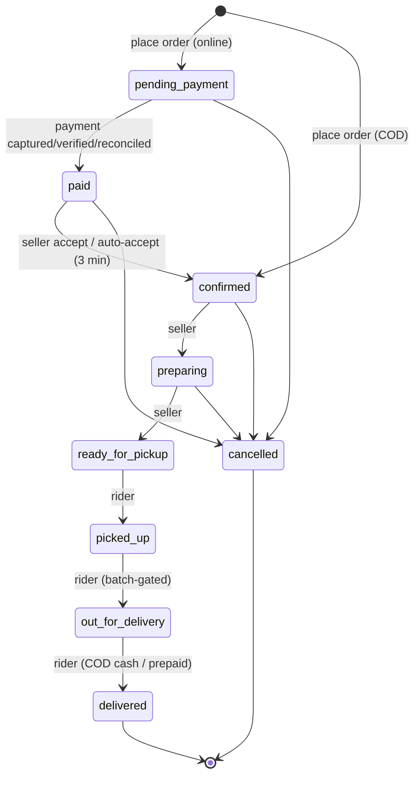

# Bringly / Chirawa — Engineering Onboarding Handbook

> **Audience:** an AI assistant (or engineer) who has never seen this repository.
> **Goal:** enough detail to continue development without re-inspecting the repo.
> **Source of truth:** the code. Where this doc and the code disagree, the code wins.
> **Optimized for completeness, not brevity.** Last compiled from the `customer-app-validation` branch.

**Brand note:** The repo, database role, Docker containers, package scope (`@chirawa/*`), and
most identifiers say **Chirawa**. The customer-facing product name is **Bringly**. They are the
same product. "Chirawa" = infra/domain/town; "Bringly" = the marketing name shown to users.
The town of Chirawa (Rajasthan, ~60,000 people, ~3 km across) is the single delivery area.

---

# 1. Project Overview

## What is Bringly?
Bringly is a **single-town quick-commerce (10–30 minute grocery/goods delivery) platform**. A
customer orders from local shops; the shopkeeper accepts and prepares; a salaried rider picks up
and delivers. It is intentionally modeled as **Blinkit/Zepto for one small town**, not a
nationwide marketplace.

## What problem does it solve?
Small towns like Chirawa have no quick-commerce coverage (the big players only serve metros). Local
shops have inventory but no digital storefront, delivery logistics, or payments. Bringly gives:
- **Customers:** a single app/website to browse a unified catalog and get fast doorstep delivery.
- **Shopkeepers (sellers):** orders, a stock console, and automatic daily settlement payouts.
- **Riders:** batched delivery assignments, live navigation targets, COD cash tracking, salary.
- **Founders (ops/admin):** dispatch monitoring, catalog moderation, and financial oversight.

## Target users
1. **Customers** — residents of Chirawa ordering groceries/daily goods. Hindi-first UI.
2. **Sellers** — local shopkeepers. One seller owns exactly one shop.
3. **Riders** — salaried delivery staff (₹7,500/mo default), not gig/per-trip.
4. **Admin/Founders** — run the town day-to-day via REST endpoints + the field apps (no admin GUI in-repo).

## Main workflow (happy path)
`Customer browses → adds to cart → checkout (COD or online) → order placed → seller accepts (or
auto-accept after 3 min) → order confirmed → auto-dispatch batches it to a rider → seller prepares
→ rider picks up → out for delivery → delivered (COD cash collected) → next-day seller settlement.`

## Current development stage
**Pre-launch, everything seeded.** There are no real users, stores, riders, or payments yet. The
backend is feature-complete and heavily unit-tested (~344 tests). The three mobile apps and the new
web storefront are built. Launch scope deliberately **hides growth loops** (referral/loyalty/wallet)
and runs at **0% commission** (delivery fee is the only revenue lever). Remaining work is
production hardening, device QA, real-credential wiring, and go-live checklists.

## Future vision
- Turn on commission (`Shop.commissionRate` / `Category.commissionRate` — schema-ready, defaulted 0).
- Re-enable growth loops (referral/loyalty/wallet — schema + partial backend already present).
- Distance-based delivery pricing (fee-rule engine + distance service exist but are dormant).
- Multi-shop marketplace browsing (currently presented as one unified storefront).
- Expand beyond Chirawa: the modular monolith is designed to peel modules into their own processes
  if a scaling profile diverges (see ADR-001).

---

# 2. Repository Structure

A **pnpm workspace monorepo** (`pnpm-workspace.yaml` globs `apps/*` and `packages/*`). Node ≥20, pnpm ≥9.

```
chirawa/
├── apps/
│   ├── api/            Fastify backend: REST + Socket.IO + BullMQ worker (the whole server)
│   ├── customer-app/   Expo/React Native — shopper app (Bringly)
│   ├── seller-app/     Expo/React Native — shopkeeper app
│   ├── rider-app/      Expo/React Native — delivery rider app
│   └── web/            Next.js 15 App Router — customer web storefront (COD-only)
├── packages/
│   ├── api-client/     Shared, framework-agnostic typed HTTP/socket client (@chirawa/api-client)
│   ├── types/          Shared DTOs, domain types, enums, `Paise` branded type (@chirawa/types)
│   └── i18n/           Shared en/hi translations (@chirawa/i18n)
├── docs/
│   ├── adr/            Architecture Decision Records (001 modular monolith, 002 integer paise)
│   ├── md file/        ~70 planning/analysis/lifecycle/audit markdowns (the project's brain-dump)
│   ├── BRINGLY_PRODUCTION_PLAN.md, BRINGLY_WEB_BUILD_PLAN.md, blinkit-redesign-plan*.md, github-secrets.md
├── scripts/
│   ├── generate-dev-keys.mjs      Generates RS256 JWT keypair for dev
│   ├── init-db.sql                Postgres init (extensions: postgis, pg_trgm)
│   ├── setup-postgis-indexes.sql  Geo/trigram indexes
│   ├── deploy.sh                  Manual Hetzner deploy (fallback for CI)
│   ├── nginx/chirawa.conf         Production reverse-proxy config (TLS, rate zones, WS upgrade)
│   ├── harness/                   Runtime verification harness (shell + TS) for flow validation
│   └── test-*.{sh,mjs}            Manual smoke scripts (payments, notifications, realtime, worker)
├── docker-compose.yml   Dev Postgres (postgis/postgis:15-3.3) + Redis 7
├── Dockerfile           Multi-stage production API image (ships via tsx, no tsc compile)
├── .github/workflows/   ci.yml (test+typecheck+docker build) · deploy.yml (Hetzner deploy)
├── .env.example         Master env reference (documents EVERY variable across the monorepo)
├── pnpm-workspace.yaml  Workspace globs + security override floors
├── tsconfig.base.json   Shared strict TS config
└── ralph.sh             (dev helper script)
```

### `apps/api` (the backend — the center of gravity)
- **Purpose:** the entire server. One deployable Node app (modular monolith, ADR-001).
- **Two OS processes from one codebase:** `src/index.ts` boots Fastify (HTTP + Socket.IO);
  `src/worker/index.ts` boots BullMQ workers + scheduler. **This split is the single most important
  architectural fact** (see §4 and §17).
- **Layout:** `src/modules/<domain>/` each own `*.routes.ts` (HTTP), `*.schema.ts` (zod), `*.service.ts`
  (business logic), plus `__tests__/`. `src/shared/` holds plugins, middleware, events, errors,
  utils, config, observability. `src/services/` holds cross-module infra services (R2, image
  pipeline, OpenFoodFacts). `src/worker/` holds jobs + queues + scheduler. `prisma/` holds the
  schema, 26 migrations, and seeds.
- **Interaction:** routes → services → Prisma/Redis/queues/event-bus. Services emit typed events;
  plugins translate events into sockets, FCM/SMS, dispatch, and auto-accept timers.

### `apps/customer-app`, `apps/seller-app`, `apps/rider-app` (Expo/React Native)
- **Purpose:** the three native mobile apps (Android-first; Expo SDK 54, RN 0.81).
- **Layout (each):** `src/screens/` (feature screens), `src/components/`, `src/context/` (Auth/Cart/Address
  React contexts), `src/services/` (`api.service.ts`, `notifications.ts`, `storage.service.ts`,
  seller's `offline-queue.ts`), `src/navigation/`, `src/theme/`, `App.tsx`, `app.json` (Expo config),
  `eas.json` (build profiles), `google-services.json` (FCM, committed).
- **Interaction:** talk to the API over REST (`/api/v1/*`) + Socket.IO. customer-app uses the shared
  `@chirawa/api-client`; seller/rider apps have their own `api.service.ts` clients.
- customer-app is the richest (39+ screens, maps, voice search, live tracking). seller/rider are leaner.

### `apps/web` (Next.js 15 storefront — newest surface, July 2026)
- **Purpose:** a **customer web storefront** mirroring the mobile customer app, **COD-only**.
- **Layout:** `src/app/` (App Router pages + `api/` route handlers for the BFF and auth),
  `src/components/` (per-feature client components), `src/context/`, `src/hooks/`, `src/lib/`
  (api clients, cookies, jwt, cart, rate-limit, service-area), `src/i18n/`, `middleware.ts`.
- **Interaction:** the browser talks **same-origin** to a Next **BFF proxy** (`/api/bff/[...path]`)
  that injects the Bearer token from an httpOnly cookie and forwards to the backend. Tokens never
  reach client JS. Live tracking connects socket.io-client directly to the backend.

### `packages/*` (shared code)
- **`api-client`** — framework-agnostic (`fetch`, no RN/DOM). Injected `TokenStorage` + `onAuthFailure`
  seams; built-in refresh-on-401-and-retry-once. `baseUrl` includes `/api/v1`. Catalog list/detail
  methods return `unknown` (typed shapes added per-consumer); everything else is typed via `@chirawa/types`.
- **`types`** — DTOs (`order.dto.ts`, `cart.dto.ts`, …), enums (order-status, payment-method/status,
  stock-status, user-role, rider-availability), domain types (`money.ts` → the **`Paise` branded type**,
  `coordinates.ts`).
- **`i18n`** — `translations.ts` (pure en/hi data), `LanguageContext.tsx`, `useT`. Note:
  `LanguageContext` historically imported RN AsyncStorage; the web app added an RN-free path (`i18n/provider.tsx`).

---

# 3. Tech Stack (and why)

### Languages
- **TypeScript everywhere** (strict). One language across backend, apps, web, and shared packages —
  small team, maximal code/type sharing via `@chirawa/*`.
- **SQL** (Postgres) via Prisma; a few raw `$queryRaw` search queries (pg_trgm).

### Backend (`apps/api`)
| Tech | Version | Why |
|---|---|---|
| **Fastify** | ^4.27 | Fast, schema-first HTTP; plugin/encapsulation model fits the module architecture. |
| **Prisma** | ^5.13 | Type-safe ORM + migrations; the schema is the single data contract. |
| **PostgreSQL + PostGIS + pg_trgm** | 15 | System of record; PostGIS for geo, pg_trgm for fuzzy search. |
| **Redis (ioredis)** | 7 | Cart store, cache, rate limits, BullMQ backing, Socket.IO adapter, cross-process event bridge. |
| **BullMQ** | ^5.7 | Durable background jobs (settlement, reconciliation, dispatch, cleanup, enrichment). |
| **Socket.IO** | ^4.7 | Realtime order status / rider location / seller alarms; Redis adapter for multi-instance fan-out. |
| **zod** | ^3.23 | Request validation (route schemas) + env validation (hard-fail on prod placeholder secrets). |
| **jsonwebtoken** | ^9 | RS256 access tokens (asymmetric: private signs, public verifies). |
| **bcryptjs** | ^2.4 | PIN hashing (cost 12) for seller/rider/admin. |
| **razorpay** | ^2.9 | Online payments (orders/verify/webhooks) + RazorpayX payouts (seller settlements). |
| **firebase-admin** | ^12 | FCM push notifications to all apps. |
| **sharp** | ^0.35 | Image pipeline (square WebP, EXIF strip, content-hash) for product images. |
| **@aws-sdk/client-s3** | ^3 | Cloudflare R2 (S3-compatible) image storage. |
| **@sentry/node** | ^10 | Error tracking (no-op without DSN). |
| **pino / pino-pretty** | ^9 | Structured logging. |
| **tsx** | ^4 | Runs TypeScript directly — **production ships via `tsx`, no `tsc` build step** (see §15). |
| **vitest** | ^1.5 | Unit/integration tests. |

### Web (`apps/web`)
| Tech | Version | Why |
|---|---|---|
| **Next.js** | ^15.5 (App Router) | SSR/ISR for SEO-able storefront + route handlers for the BFF/auth. |
| **React** | 19.1 | Latest; RSC + client components. |
| **Tailwind CSS** | ^3.4 | Utility styling; theme tokens ported from the mobile app. |
| **TanStack Query** | ^5 | Client-side authed data fetching through the BFF. |
| **socket.io-client** | ^4.8 | Live order tracking (connects directly to backend). |

### Mobile (`apps/*-app`)
- **Expo SDK 54 / React Native 0.81** — dev-client builds (NOT Expo Go — native modules used).
- Key native modules: `expo-secure-store` (tokens), `expo-notifications` (FCM), `expo-location` +
  `react-native-maps` (address pin, live tracking), `expo-contacts` (receiver contact), customer:
  `expo-speech-recognition` (voice search); seller: barcode scanner.
- **EAS** for cloud builds; `google-services.json` committed for all three apps.

### Package manager / build / hosting
- **pnpm** ≥9 (workspace). **Docker** multi-stage for the API. **PM2** (cluster) in production.
- **Hosting:** a **Hetzner** VPS (`/opt/chirawa`), nginx reverse proxy + Certbot TLS, images via
  **GitHub Container Registry** (`ghcr.io`). CI/CD via **GitHub Actions**.
- **External APIs:** Razorpay/RazorpayX, FCM, Fast2SMS (OTP/SMS), Mappls/MapmyIndia (geo proxy),
  Cloudflare R2 (images), OpenFoodFacts (catalog enrichment), Google Maps (client map render only).

### Why this stack
Small (2-person) team, single town, ~500 orders/day target. A **modular monolith** on one strong
server beats microservices at this scale (ADR-001). TypeScript end-to-end maximizes sharing. Prisma+zod
give type safety from DB to HTTP edge. Redis+BullMQ give durable async without extra infra. `tsx`-in-prod
trades a compile step for deploy simplicity (and creates the typecheck debt noted in §15).

---

# 4. System Architecture

## 4.1 Layered overview

```mermaid
flowchart TB
  subgraph Clients
    CA[customer-app RN]
    SA[seller-app RN]
    RA[rider-app RN]
    WEB[web Next.js BFF]
  end
  subgraph APIproc["API process ×4 (PM2 cluster)"]
    RT[REST /api/v1/*]
    IO[Socket.IO + Redis adapter]
    PL[Plugins: prisma redis event-bus queue realtime notifications dispatch seller-timeout]
  end
  subgraph Worker["Worker process ×1 (PM2 fork)"]
    JOBS[BullMQ jobs + scheduler]
  end
  subgraph Data
    PG[(Postgres 15 + PostGIS + pg_trgm)]
    RD[(Redis 7)]
  end
  subgraph External
    RZP[Razorpay / RazorpayX]
    FCM[FCM]
    SMS[Fast2SMS]
    MAP[Mappls]
    R2[Cloudflare R2]
    OFF[OpenFoodFacts]
  end

  CA & SA & RA -->|HTTPS REST + WebSocket| RT
  WEB -->|same-origin BFF proxy| RT
  CA & SA & RA -.WebSocket.-> IO
  WEB -.socket.io-client.-> IO
  RT --> PG
  RT --> RD
  PL -->|event-bus + Redis pub/sub| IO
  RT -->|enqueue| RD
  RD -->|BullMQ| JOBS
  JOBS --> PG
  JOBS --> RZP
  JOBS --> R2 & OFF
  PL --> FCM & SMS
  RT --> MAP & R2
```

## 4.2 Request → persistence path (vertical slice)
```
Mobile/web  →  Fastify route (modules/<m>/<m>.routes.ts)
   preHandler: authenticate → requireRole(...)   (shared/middleware/auth.middleware.ts)
   zod parse (modules/<m>/<m>.schema.ts)
→  Service (modules/<m>/<m>.service.ts)  — business rules + order state machine
   ├─► app.prisma  → PostgreSQL
   ├─► app.redis   → cart / cache / tokens
   ├─► app.queues  → BullMQ (worker)
   └─► emit*()     → event-bus  (local EventEmitter + Redis publish)
                       ├─► realtime.plugin → Socket.IO rooms
                       ├─► notifications.plugin → FCM / SMS
                       ├─► dispatch.plugin → batching/assignment
                       └─► seller-timeout.plugin → auto-accept timer
```

## 4.3 Plugin load order (`apps/api/src/app.ts`)
1. `prisma` → `app.prisma`
2. `redis` → `app.redis`
3. `event-bus` (after redis — starts the Redis pub/sub bridge for cross-process events)
4. `queue` (after prisma+redis — `app.queues`: settlement, reconciliation, cleanup, referral,
   order-assignment, seller-accept, enrichment)
5. `realtime` (Socket.IO + Redis adapter; wires event-bus → socket broadcasts)
6. `notifications` (wires event-bus → FCM/SMS)
7. `dispatch` (on `ORDER_STATUS_CHANGED:confirmed` → batch + schedule assign)
8. `seller-timeout` (on `NEW_ORDER_FOR_SELLER` → schedule auto-accept; **runs the auto-accept worker
   in the API process** so its `confirmed` emit reaches dispatch+notifications)
9. HTTP plugins (`sensible`, `helmet` with CSP off, `cors` from `FRONTEND_URLS`, `rate-limit`, `multipart`)
10. global error handler + `/health` (liveness) + `/ready` (DB+Redis readiness, 503 if not)
11. module routes under `/api/v1/*`

## 4.4 The two-process model (critical)
Socket.IO and FCM listeners run **only in the API process**. Some emitters run in the **worker**
(batching assigns riders; reconciliation marks orders paid). A plain `EventEmitter` is in-process
only, so worker-emitted events would be dropped. Two mechanisms close the gap:
1. **Redis pub/sub bridge** (`shared/events/event-bus.ts`, channel `chirawa:events:v1`) — every emit
   is delivered locally **and** published to Redis; the other process's `startEventBusBridge()`
   re-emits it locally (self-echo suppressed via a `PROCESS_ID` tag). **Fire-and-forget, lossy, no replay.**
2. **Durable direct effects** where loss is unacceptable: e.g. the payment-reconciliation job does
   NOT rely on the bridge — it enqueues the seller auto-accept BullMQ job and sends the seller FCM
   itself (`reconciliation.job.ts`). **Design rule: must-happen work → Postgres + BullMQ; live
   niceties (socket pushes) → the bus/bridge.**

## 4.5 Realtime rooms & events
- **Rooms:** `user:{userId}`, `seller:{userId}`, `rider:{userId}`, `order:{orderId}`.
- `order:subscribe` is **IDOR-guarded** (only the order's customer/seller/rider/admin may join —
  `realtime.helpers.ts`).
- **Server→client:** `order:status`, `order:location`, `order:eta` (sent as duration + `serverNow`
  for clock-skew safety), `order:new` (seller alarm), `order:cancelled`, `order:assigned`,
  `order:item-unavailable`, `rider:availability:confirmed`, `connected`.
- **Client→server:** `order:subscribe/unsubscribe`, `rider:location` (~every 8s), `rider:availability`.
- **Internal event bus events:** `ORDER_STATUS_CHANGED`, `NEW_ORDER_FOR_SELLER`,
  `ORDER_CANCELLED_FOR_SELLER`, `ORDER_ASSIGNED_TO_RIDER`, `ORDER_ITEM_UNAVAILABLE`, `ORDER_ETA_CHANGED`.

---

# 5. Features Implemented

Status legend: **✅ Implemented · 🟡 Partial/config-only · ⚪ Stub/disconnected · 💀 Hidden(dead in v1) · 🧪 Dormant**

### Customer (mobile app + web)
| Feature | Status | Key files | Endpoints |
|---|---|---|---|
| Phone OTP login/signup (customer auto-created) | ✅ | `auth.service.ts`, `otp.service.ts`, `token.service.ts`, app `auth/*` screens | `POST /auth/send-otp`,`/verify-otp`,`/refresh`,`/logout` |
| Profile & language (Hindi default) | ✅ | `users.service.ts`, `profile/*` | `GET/PUT /users/me` |
| Address book + map pin + reverse geocode | ✅ | `users.service.ts`, `geo.service.ts`, `AddressContext` | `.../me/addresses`, `POST /geo/reverse|autocomplete|place` |
| Home feed (Daily Essentials, Bestsellers, Categories, Specials, Shops-nearby) | ✅ | `aggregation.service.ts`, `catalog.service.ts`, `home/*` | `GET /catalog/{feed,daily-essentials,bestsellers,categories,specials,shops,category-images}` |
| Aggregated "one store" catalog (shop identity hidden) | ✅ | `aggregation.service.ts` (single-flight Redis lock) | `GET /catalog/feed` |
| Search + autocomplete (pg_trgm + Hinglish aliases) | ✅ | `catalog.service.ts` (`$queryRaw`), `hinglish-aliases.ts` | `GET /search`,`/search/suggest`,`/catalog/search` |
| Product detail + variants | ✅ | `product/*`, `ProductCard` | `GET /catalog/products/:id` |
| Cart (multi-shop, Redis-primary) | ✅ | `cart.service.ts`, `CartContext` | `GET/POST/PUT/DELETE /cart[...]` |
| Checkout + pricing preview + promo | ✅ | `pricing.service.ts`, `promotions.service.ts`, `orders.service.ts`, `resolver.service.ts` | `POST /pricing/preview`, `POST /orders` |
| Payment (Razorpay, mobile) | ✅ | `payments.service.ts`, `razorpay.service.ts`, `RazorpayCheckout.tsx` | `POST /payments/orders/:id`,`/verify/:id`,`/webhook/razorpay` |
| Payment (web) | **COD only** | web `checkout/*` — no Razorpay UI | `POST /orders` with `paymentMethod:'cod'` |
| Live order tracking (Tracking V2) | ✅ | `OrderTrackingScreen.tsx`/web `tracking/*`, `realtime.plugin.ts` | `GET /orders/:id`,`/group/:groupId`,`/delivery/orders/:id/rider-location` |
| Server-computed ETA (no map calls) | ✅ | `eta.service.ts` | surfaced in `GET /orders/:id`; `order:eta` socket |
| Order history / cancel / rate / edit address+receiver | ✅ | `orders.service.ts`, `OrderHistoryScreen` | `GET /orders`, `DELETE /orders/:id`, `POST /orders/:id/rating`, `PATCH .../delivery-address|receiver` |
| Item-unavailable live update + substitute suggestion | ✅ | `orders.service.ts:riderReportItemUnavailable` | (socket `order:item-unavailable`) |
| "Request this item" + restock notify | ✅ | `requests.service.ts` | `POST /catalog/requests` |
| Push notifications | ✅ | `notifications.plugin.ts`, `fcm.service.ts` | `POST/DELETE /notifications/register-token`, `GET /notifications` |
| Voice search (customer) | ✅ | `useVoiceSearch.ts`, `VoiceSearchSheet.tsx` (native speech) | (client feature) |
| Referral / Loyalty / Wallet | 💀 Hidden | gated by `config/features.ts` `growthLoops:false` | `GET /users/me/loyalty` works; `GET /loyalty` ⚪ stub |

### Seller (mobile app)
| Feature | Status | Endpoints |
|---|---|---|
| OTP + PIN login | ✅ | `/auth/send-otp`,`/verify-otp`,`/set-pin` |
| Order queue (accept/reject/preparing/ready) | ✅ | `POST /orders/:id/{accept,reject,preparing,ready}` |
| Auto-accept on 3-min timeout (background) | ✅ | `seller-timeout.plugin.ts`, `orders.service.autoAcceptOrder` |
| Stock mgmt (status toggle + numeric qty + CRUD + variants + CSV) | ✅ | `PATCH /catalog/products/:id/stock`, `.../stock-qty`, product/category/variant CRUD, `POST /catalog/products/import` |
| Barcode scan → "I stock this" + offline queue | ✅ | `GET /catalog/master/:barcode`, `POST /catalog/products/stock-this` |
| Report wrong image | ✅ | `POST /catalog/products/:id/report-image` |
| Sales summary + settlement history | ✅ | `GET /sellers/me/sales-summary`,`/settlements` |

### Rider (mobile app)
| Feature | Status | Endpoints |
|---|---|---|
| OTP + PIN login | ✅ | `/auth/...`,`/set-pin` |
| Online/offline availability + live location push | ✅ | `GET/PATCH /delivery/availability`; sockets `rider:availability`,`rider:location` |
| Incoming-batch assignment alarm | ✅ | (socket `order:assigned` + FCM) |
| Active delivery / batch (pickup → out-for-delivery, batch-gated) | ✅ | `GET /delivery/active`, `POST /delivery/orders/:id/{pickup,start-delivery}` |
| Delivery completion (prepaid + COD, cash ledgered) | ✅ | `POST /orders/:id/delivered`, `POST /orders/:id/cod-collected` |
| Report item unavailable at pickup | ✅ | `POST /delivery/orders/:id/items/:itemId/unavailable` |
| Earnings (salary + COD balance) | ✅ (UI) / 🟡 static data | (from profile/COD balance; no rider self-settlement endpoint) |

### Backend platform / background
| Feature | Status | Files |
|---|---|---|
| Order state machine (9 states, CAS transitions) | ✅ | `orders/order-status.ts` |
| Auto-dispatch via batching (≤3 orders / 800m / same zone / 3-min window; retry 10×60s → SMS escalate) | ✅ | `dispatch.plugin.ts`, `batching.service.ts`, `worker/jobs/assignment.job.ts` |
| Payment webhook + reconciliation (every 15 min) | ✅ | `payments.service.ts`, `worker/jobs/reconciliation.job.ts` |
| Seller daily settlement + RazorpayX payouts + payout reconcile | ✅ (🟡 settlement notify TODO) | `worker/jobs/settlement.job.ts` |
| Notifications fan-out (event → FCM/SMS + socket) | ✅ | `notifications.plugin.ts`, `realtime.plugin.ts` |
| Cross-process event bus (Redis bridge) | ✅ | `shared/events/event-bus.ts` |
| Catalog image enrichment (OpenFoodFacts → R2, nightly) | ✅ (gated on dump path) | `worker/jobs/enrichment.job.ts`, `services/{off-source,image-pipeline,r2}.ts` |
| Referral credit unlock | ⚪ Disconnected | `worker/jobs/referral.job.ts` fully implemented, but producer `enqueueReferralUnlock` only `console.log`s — never enqueues |
| Maintenance cleanup jobs | ✅ | `worker/jobs/cleanup.job.ts` |
| Audit log | 🟡 table only | `AuditLog` model + `AuditAction` enum; no write call sites found |
| Fee rules / pricing engine | ✅ flat path active; 🧪 distance dormant | `pricing/pricing.service.ts`, `pricing/distance.service.ts` |
| Promotions (flat/percent/free_delivery; FIRSTORDER auto) | ✅ | `promotions/promotions.service.ts` |
| COD float cap | 🟡 config only | `COD_FLOAT_CAP_PAISE` in env; no enforcement in COD path |

**Limitations to remember:** no seller-facing product CRUD in the API *for onboarding* — catalog is
loaded by ops via `/admin/products/import` (sellers manage *stock* on their existing products, and
can barcode-add via "I stock this"). No in-app "reject assignment" for riders (columns exist; ops
reassigns). No admin GUI app — admin = REST endpoints. Web is COD-only.

---

# 6. User Flow

## 6.1 Customer order lifecycle (the spine)


`delivered` and `cancelled` are terminal. Every write goes through `transitionOrderStatus()` which
(1) rejects illegal jumps, (2) does an atomic compare-and-set (`updateMany WHERE status=from`; a lost
race returns false, never clobbers), (3) stamps the per-status timestamp, (4) appends an
`OrderStatusHistory` row — all inside the caller's DB transaction.

## 6.2 Signup / login
- **Customer:** phone → OTP (`send-otp`→`verify-otp`). New phone auto-creates `User(role=customer)` +
  empty `CustomerProfile` + a referral code. `SetupProfileScreen` for name.
- **Seller/Rider/Admin:** OTP **+ PIN**. `verify-otp` returns `requiresPin=true` until a PIN is set →
  `SetPinScreen` (bcrypt cost 12). 5 wrong PINs → 15-min lockout.
- **Dev bypass OTP is `123456`** when `NODE_ENV=development`.

## 6.3 Browse → cart → checkout
Home feed / search / product detail → add to cart (Redis `cart:{userId}`, multi-shop) → checkout
calls `POST /pricing/preview` (flat fee; promo/FIRSTORDER) → `POST /orders` (idempotent) splits the
cart into one child `Order` per shop under one `OrderGroup`; aggregated lines resolve to fewest
in-stock shops; oversell-protected atomic stock decrement.

## 6.4 Payment
- **COD:** order starts at `confirmed`; seller notified immediately; cash collected at delivery.
- **Online:** one Razorpay order for the multi-shop grand total; verify (client) + webhook (durable)
  + 15-min reconciliation all converge on `markOrderPaid`.

## 6.5 Seller queue
`order:new` socket alarm + FCM → accept/reject/preparing/ready. If ignored 3 min, `autoAcceptOrder`
forces `confirmed` and bumps `missedAcceptances`.

## 6.6 Dispatch → delivery
`confirmed` triggers batching → `assign-batch` worker job picks the online rider with fewest active
deliveries → `ORDER_ASSIGNED_TO_RIDER` (rider alarm). Rider: pickup → (batch-gated) start-delivery →
deliver. COD credits `RiderProfile.codBalancePaise` by the **server-derived** total (client amount
advisory). Customer live map fed by `rider:location`.

## 6.7 Post-delivery
Customer can rate once (after `delivered`). Next-day settlement pays the seller for delivered goods.

## 6.8 Web-specific flow
Guest cart in `localStorage` → on OTP login, replayed into the server cart → COD checkout (with
geo-assisted address) → order confirmation → live tracking (socket + 15s poll fallback). Gated
routes (`/checkout`, `/order`, `/orders`, `/account`) redirect to `/login` when no session cookie.

---

# 7. Database Design

**Engine:** PostgreSQL 15 + PostGIS + pg_trgm (extensions created in `scripts/init-db.sql`).
**ORM:** Prisma (`apps/api/prisma/schema.prisma`, ~1058 lines, ~45 models / 11 enums, 26 migrations).
**Money:** every monetary column is **integer paise, never float** (ADR-002). **Addresses on orders
are snapshotted, not FK'd** (orders are immutable). `snake_case` columns via `@map`; UUID PKs.

## 7.1 Enums
`UserRole{customer,seller,rider,admin}` · `OrderStatus{pending_payment,paid,confirmed,preparing,
ready_for_pickup,picked_up,out_for_delivery,delivered,cancelled}` · `PaymentMethod{upi,card,wallet,cod}`
· `PaymentStatus{pending,captured,failed,refunded,partially_refunded}` · `StockStatus{available,
out_of_stock,hidden}` · `MasterStatus{needs_review,approved,rejected}` · `RiderAvailabilityStatus{
online,offline,on_delivery}` · `TransactionType{customer_payment,seller_settlement,refund,
wallet_credit,wallet_debit,rider_salary,rider_cod_collection,rider_cod_settlement,platform_fee,
promotional_credit,referral_credit}` · `SettlementStatus{pending,processing,paid,failed}` ·
`NotificationChannel{fcm,sms,in_app}` · `AuditAction{login,logout,profile_update,refund_issued,
order_cancelled,admin_action,payment_event,security_event}`.

## 7.2 Tables (grouped)

**Identity**
- `users` — `phone` (unique, VarChar(15)), `role`, `isActive`, soft-delete `deletedAt`. Indexed on role.
- `customer_profiles` / `seller_profiles` / `rider_profiles` / `admin_profiles` — 1:1 with `users`
  (unique `userId`, cascade delete). PIN hash + `pinFailCount`/`pinLockedUntil` on seller/rider/admin.
  - `seller_profiles`: `ownerName`, `upiId`, `bankAccount`/`bankIfsc`, `gstin`, cached
    `razorpayContactId`/`razorpayFundAccountId`, `missedAcceptances`.
  - `rider_profiles`: `fullName`, `vehicleNumber`, `licenseUrl`/`rcUrl`, `securityDepositBalance`,
    **`monthlySalaryPaise` (default 750000)**, **`codBalancePaise`** (cash owed to platform).
  - `admin_profiles`: `permissionLevel`, `ipAllowlist[]`, `totpSecret`.

**Catalog**
- `shops` — 1:1 with seller (unique `sellerId`). `lat`/`lng` (Decimal), `isActive` (**default false**),
  `isOpen` (default false), `isFeatured` ("Chirawa Special"), `commissionRate` (default 0),
  `prepTimeMinutes` (default 8, feeds ETA), `estimatedDeliveryMinutes` (marketing). Indexes: isActive,
  isOpen, isFeatured, (lat,lng).
- `categories` — hierarchical (self-ref `parentId`), per-shop, `commissionRate` (default 0).
- `products` — `price`/`mrpPaise` (paise), **`stockQty` (nullable = untracked)**, `stockStatus`,
  `barcode` (VarChar(14), **not unique** — recurs per shop), `masterId` → `master_catalog`, `attributes`
  (Json chips). Indexes: `(shopId,stockStatus,isActive)`, `categoryId`, `name`, `barcode`,
  `(masterId,stockStatus,isActive)` (aggregation).
- `product_variants` — pack sizes; own `price`/`stockQty` override.
- `product_images` — `url`, `source`/`license`/`attribution` (legal provenance for takedowns).
- `master_catalog` — global barcode "dictionary" (unique `barcode`), canonical `name`/`imageUrl` (on
  our R2), `status` (moderation gate), enrichment tracking. **Not sellable.** Drives cross-shop aggregation.
- `product_requests` — demand capture ("request this item"); `notifyOnRestock`/`notifiedAt`.
- `image_reports` — "wrong image" flags; re-gate the linked master to `needs_review`.

**Address / Cart**
- `addresses` — soft-delete (`isDeleted`), one `isDefault` at a time, receiver contact fields, `mapsLink`.
- `carts` / `cart_items` — a DB **recovery copy** of the cart (Redis is primary). Unique `(cartId,productId)`.

**Orders & money** (all paise)
- `orders` — the core entity. **Address snapshotted** (`deliveryStreet…deliveryLng`). One Order = one
  shop; `groupId` ties children into an `order_groups`. `riderId` = **denormalized `RiderProfile.id`
  (NO FK relation)**. Per-status timestamps; ETA fields; rating fields; `distanceKm`/`distanceSource`
  (flat path stamps 0/`'flat'`). Indexes: `(customerId,createdAt desc)`, `(status,createdAt)`,
  `(status,estimatedDeliveryAt)`, `(shopId,createdAt desc)`, `(riderId,status)`, `groupId`.
- `order_groups` — customer-facing wrapper over N per-shop child orders.
- `order_items` — snapshot name/price/qty; `fulfillmentStatus` (`fulfilled`|`unavailable_refunded`) +
  `refundedPaise` (item-unavailable safety net).
- `order_status_history` — append-only audit of every transition (role/id/reason).
- `payments` — `razorpayOrderId`, `razorpayPaymentId` (unique), `status`, `refundedPaise`.
- `payment_webhook_events` — webhook idempotency (`eventId` unique).

**Delivery**
- `delivery_assignments` — rider↔order link; `isActive` is what puts an order in a rider's active list.
  Has `rejectedAt`/`rejectReason` columns (unused today).
- `rider_locations` — GPS pings (7-day retention). `rider_availability` — online/offline/on_delivery +
  last coords (unique `riderId`). `delivery_zones` (polygon Json). `batches` (status open/assigned/
  completed/cancelled; anchor coords; `closesAt`). `rider_zones` (rider↔zone N:N).

**Pricing / ledger / settlement**
- `fee_rules` — versioned pricing (unique `version`); v1 seed contains distance bands (dormant; flat
  path used live).
- `transactions` — append-only money ledger (polymorphic `referenceId`/`referenceType`). **Written only
  when money actually moves.**
- `settlements` — seller daily payouts; unique `(sellerId, periodDate)`; `status`, `needsAttention`,
  `payoutId`, `failureReason`, `platformFeePaise` (hardcoded 0 at launch).
- `rider_settlements` — monthly salary; unique `(riderId, month, year)`. (No recurring job yet.)

**Loyalty/wallet/referral (dormant in v1)**
- `wallet_transactions`, `loyalty_tiers` (bronze/silver/gold seeded), `referral_codes`,
  `referral_redemptions`.

**Promotions**
- `promo_codes` (`type` flat|percent|free_delivery, usage caps), `promo_redemptions` (unique
  `(promoCodeId,userId)`).

**Auth/ops/security**
- `otp_attempts` (audit), `refresh_tokens` (hashed `tokenHash` unique, rotation), `audit_log` (defined,
  not populated), `notifications` (per-send log), `stock_update_log` (from/to + actor), `app_config`
  (key/value ops config, e.g. `support_phone`), `search_aliases` (synonym expansion).

## 7.3 Key relationships
```
User 1:1 {Customer|Seller|Rider|Admin}Profile ; 1:N Address, Order(customer), RefreshToken, Notification
SellerProfile 1:1 Shop 1:N Category, Product, Order, Settlement
Product N:1 MasterCatalog ; 1:N ProductVariant, ProductImage
Order N:1 OrderGroup, Shop, Address, PromoCode, Batch ; 1:N OrderItem, OrderStatusHistory, Payment, DeliveryAssignment
Order.riderId → RiderProfile.id (denormalized, NO FK — see §24)
DeliveryAssignment N:1 RiderProfile, Order ; Batch N:1 DeliveryZone ; RiderProfile N:N DeliveryZone (RiderZone)
```

## 7.4 Why designed this way
- **Address snapshot on orders** → order records are immutable audit artifacts even if the address is
  later edited/deleted.
- **One Order per shop + OrderGroup wrapper** → sellers/riders/settlement operate per-shop, while the
  customer sees a single order + one tracking view.
- **`Order.riderId` denormalized** → fast rider-order lookups; the FK-less design is the source of the
  "BUG-1" class of bugs (see §14/§24).
- **Opt-in numeric `stockQty` (null = untracked)** → shops that don't track counts still work; those
  that do get atomic oversell protection.
- **MasterCatalog dictionary** → cross-shop aggregation ("one store" feel) and community/OFF enrichment
  with a moderation gate.
- **Append-only `transactions`/`order_status_history`** → auditable money + state trails.

---

# 8. API Documentation

All routes are under **`/api/v1`** (registered in `app.ts`). **Uniform response shape:**
success returns the payload; errors return `{ success:false, error:{ code, message } }` with
`SCREAMING_SNAKE_CASE` codes (e.g. `VALIDATION_ERROR`, `RATE_LIMIT_EXCEEDED`, `SHOP_CLOSED`,
`INTERNAL_ERROR`). Auth is **RS256 JWT** in `Authorization: Bearer <token>`; access = `{sub:userId,
role, profileId}`, 15-min TTL. Role guards via `requireRole(...)` preHandlers.

> The exhaustive list lives in `packages/api-client/src/index.ts` and each `modules/*/*.routes.ts`.
> Below is the working surface grouped by module (method · route · purpose · auth · impl file).

### Health
- `GET /health` — liveness (process up). public. `app.ts`
- `GET /ready` — readiness (DB+Redis reachable; 503 if not). public. `app.ts`

### Auth (`modules/auth/auth.routes.ts`)
- `POST /auth/send-otp` `{phone}` — send OTP (Fast2SMS; dev logs). public. Rate-limited.
- `POST /auth/verify-otp` `{phone,otp}` → `{tokens,isNewUser,requiresPin,role}`. public.
- `POST /auth/refresh` `{refreshToken}` → rotated `{tokens}`. public. Reuse → revoke all sessions.
- `POST /auth/set-pin` `{pin}` — seller/rider/admin PIN setup (bcrypt). auth.
- `POST /auth/logout` — revoke refresh token. auth.

### Users (`modules/users`)
- `GET /users/me`, `PUT /users/me` — profile. auth.
- `GET/POST /users/me/addresses`, `PUT/DELETE /users/me/addresses/:id`, `PATCH .../:id/default`. auth.
- `GET /users/me/loyalty` — loyalty tier (works; UI hidden). auth.

### Catalog & Search (`modules/catalog`)
- `GET /catalog/{shops,products,products/:id,feed,daily-essentials,specials,categories,category-images,
  bestsellers,search,master/:barcode}` — public reads (Redis-cached).
- Seller stock/CRUD (auth, seller): `PATCH /catalog/products/:id/stock`, `.../stock-qty`;
  `POST/PATCH/DELETE /catalog/products[/:id]` + `/variants[/:id]`; `POST/PATCH/DELETE /catalog/categories[/:id]`;
  `POST /catalog/products/import` (CSV); `POST /catalog/products/stock-this` (barcode upsert);
  `POST /catalog/upload-image`; `POST /catalog/products/:id/report-image`; `POST /catalog/requests`.
- `GET /search`, `GET /search/suggest` — pg_trgm + Hinglish aliases. public.

### Cart (`modules/cart`) — auth
- `GET /cart`, `POST /cart/items`, `PUT /cart/items/:productId`, `DELETE /cart`.

### Pricing (`modules/pricing`) — auth
- `POST /pricing/preview` `{cartId,addressId,promoCode?}` → fee/discount/total breakdown (Hindi text).

### Orders (`modules/orders`)
- `POST /orders` `{cartId,addressId,paymentMethod,promoCode?}` — place (idempotent via `Idempotency-Key`
  or `auto:{cartId}`). COD → 201 order directly; online → `pending_payment`. auth (customer).
- `GET /orders`, `GET /orders/:id`, `GET /orders/group/:groupId` — read (ownership-gated; rider
  name/phone exposed only during active delivery). auth.
- `DELETE /orders/:id` — customer cancel. `POST /orders/:id/rating`. `PATCH /orders/:id/delivery-address|receiver`. auth.
- Seller (requireRole seller): `POST /orders/:id/{accept,reject,preparing,ready}`.
- Rider (requireRole rider): `POST /orders/:id/cod-collected` `{amountPaise?}` (advisory),
  `POST /orders/:id/delivered`.

### Payments (`modules/payments`)
- `POST /payments/orders/:orderId` — create Razorpay order (dedup pending row). auth.
- `POST /payments/verify/:orderId` — signature verify → mark paid. auth.
- `POST /payments/webhook/razorpay` — idempotent webhook (process-then-record). public (HMAC-verified).
- `POST /payments/refund/:orderId` — admin force-refund. requireRole admin.

### Delivery (`modules/delivery`)
- `GET/PATCH /delivery/availability` — rider online/offline. requireRole rider.
- `GET /delivery/active` — current trip/batch. rider.
- `POST /delivery/orders/:id/{pickup,start-delivery}`; `POST /delivery/orders/:id/items/:itemId/unavailable`. rider.
- `GET /delivery/orders/:orderId/rider-location` — last known rider location (tracking fallback). auth.
- `POST /delivery/orders/:orderId/assign` — manual assign. requireRole admin.

### Sellers (`modules/sellers`) — requireRole seller
- `GET /sellers/me/sales-summary`, `GET /sellers/me/settlements`.

### Admin (`modules/admin`, all requireRole admin)
- `GET /admin/dispatch` — live ops snapshot (active orders, unassigned flag, online riders).
- Moderation: `GET /admin/moderation/{masters,image-reports,price-outliers}`,
  `PATCH /admin/masters/:id/status`, `POST /admin/image-reports/:id/resolve`,
  `POST /admin/masters/:id/takedown`, `GET /admin/{coverage,metrics,product-requests}`.
- Catalog ops: `POST /admin/products/import` (≤500 rows), `POST /admin/upload-image`,
  `PUT /admin/products/:id/image(s)`, `PATCH /admin/shops/:id/images`.
- Search aliases: `POST/PATCH/GET /admin/search-aliases`.

### Geo (`modules/geo`) — auth
- `POST /geo/reverse`, `POST /geo/autocomplete`, `POST /geo/place` — Mappls proxy.

### Notifications (`modules/notifications`) — auth
- `POST/DELETE /notifications/register-token`, `GET /notifications`, `PATCH /notifications/:id/read`.

### Loyalty (`modules/loyalty`)
- `GET /loyalty` — ⚪ stub (growth loops hidden).

**Web BFF allowlist:** the web app only proxies a **subset** of the above (customer storefront
surface) through `/api/bff/[...path]` — admin/seller/payment/loyalty routes are unreachable via the
BFF by design (see `apps/web/src/app/api/bff/[...path]/route.ts`).

---

# 9. Frontend

Two frontend families: **React Native (Expo)** × 3 apps, and **Next.js** web.

## 9.1 React Native apps (`apps/customer-app` richest; seller/rider leaner)
- **Routing/navigation:** React Navigation (`src/navigation/AppNavigator.tsx`, `CustomTabBar.tsx`,
  `ref.ts` for imperative nav). Screens in `src/screens/<feature>/`.
- **State management:** React Context — `AuthContext`, `CartContext`, `AddressContext` (customer);
  `AuthContext` (seller/rider). No Redux. Server data fetched imperatively via `services/api.service.ts`.
- **Data fetching:** customer uses `@chirawa/api-client`; seller/rider have their own `api.service.ts`.
  Realtime via `socket.io-client`.
- **Hooks:** `useVoiceSearch`, `useStoreClosed` (operating hours), `usePlaceSearch`.
- **Reusable components:** `src/components/ui/*` (Text, Card, Badge, Toast, Shimmer, PressableScale,
  DotsLoader, RatingBadge…), plus feature components (`product/ProductCard`, `tracking/TrackingMap`,
  `payment/RazorpayCheckout`, `location/*`, `search/VoiceSearchSheet`, cart pills).
- **Styling/theme:** `src/theme/index.ts` design tokens. Primary `#FF6B35`, page bg warm cream
  `#FFF5EE`, special accent `#C4383A`; radius/spacing/font scales; **Hindi default**. customer-app has
  an animated "night theme" home (Starfield/Moon/Planet). (Note: `app.json` splash uses `#FF3E6C`.)
- **Forms/validation:** local component state; server-side zod is the real gate.
- **Config:** `src/config/features.ts` (`growthLoops:false`, `shopBrowsing:false`), `src/config/devHost.ts`
  (resolves `EXPO_PUBLIC_API_HOST`).
- **i18n:** `@chirawa/i18n` (en/hi), `LanguagePickerScreen`.
- **Notifications:** `components/NotificationsBootstrap.tsx` + `services/notifications.ts` (FCM token
  register, `chirawa_alerts` high-priority channel for seller/rider alarms).

## 9.2 Web (`apps/web`, Next.js 15 App Router + React 19)
- **Routing:** file-based App Router. Pages: `page.tsx` (home, ISR), `shop/[shopId]` (ISR+SSG+JSON-LD),
  `product/[productId]` (ISR+JSON-LD), `search` (CSR, noindex), `cart` (CSR guest), `login` (CSR OTP),
  `checkout` (CSR gated, COD), `order/[orderId]` (confirm+track), `orders` (history), `account/**`.
- **Server surface:** `app/api/bff/[...path]/route.ts` (generic proxy), `app/api/auth/{verify-otp,
  logout,session,socket-token}/route.ts` (cookie minting + session probe).
- **Components:** `src/components/<feature>/*Client.tsx` (client components), `ui/*` (Button, Card,
  OtpInput, QtyStepper, RailScroller, Reveal), `layout/*` (Header, Footer, BottomNav, LocationPill),
  `tracking/*`, `checkout/*`, `search/*`, `home/*`.
- **State:** `context/{AuthState,GuestCartContext,LocationContext}.tsx`; **TanStack Query** for authed
  data via the BFF; RSC `fetch` for SSR browse.
- **Hooks:** `useDebounce`, `useOrderSocket` (live tracking + poll fallback).
- **lib:** `api/{browser,server,refresh,cookies,cookie-names}.ts`, `jwt.ts`, `cart.ts`/`cartSync.ts`,
  `rate-limit.ts`, `serviceArea.ts`, `format.ts`, `catalog-types.ts`.
- **Styling:** Tailwind 3.4 with mobile theme tokens ported; theme-aware.
- **Auth model:** httpOnly cookies + same-origin BFF (tokens never touch JS). `middleware.ts` does
  CSRF (same-origin check on state-changing `/api/*`) + soft route-gating.
- **Security headers/CSP:** strict static CSP in `next.config.mjs` (no third-party scripts; script-src
  keeps `'unsafe-inline'` for Next hydration; connect-src whitelists the socket origin).

---

# 10. Backend

## Architecture
**Modular monolith** (ADR-001). One Fastify app, strict module boundaries enforced by ESLint
`no-restricted-imports` (cross-module access only via a module's exported service). Two runtime
processes (API + worker) from one codebase.

## Modules (`src/modules/<domain>/`)
Each domain owns: `*.routes.ts` (HTTP + preHandlers), `*.schema.ts` (zod), `*.service.ts` (business
logic), `__tests__/`. Domains: `auth`, `users`, `catalog` (+ `aggregation`, `inventory`, `master`,
`moderation`, `requests`, `search`, `hinglish-aliases`), `cart`, `pricing` (+ `distance`),
`promotions`, `orders` (+ `order-status`, `eta`, `resolver`, `seller-timeout.plugin`), `payments`
(+ `razorpay.service`), `delivery` (`dispatch.service`, `batching.service`, `dispatch.plugin`),
`notifications` (`notifications.plugin`, `fcm.service`, `sms.service`, `notification.templates`),
`sellers`, `loyalty` (stub), `admin`, `geo`.

## Services (cross-cutting infra) — `src/services/`
`r2.service.ts` (Cloudflare R2 upload), `image-pipeline.ts` (sharp: square WebP, EXIF strip,
content-hash), `off-source.ts` (OFF bulk dump reader), `off-live.ts` (single OFF lookup).

## Controllers vs services
No separate controller layer — route handlers are thin (parse + auth + call service). Business logic
lives entirely in services. The **order state machine** (`orders/order-status.ts`) is the most
important service primitive.

## Models
Prisma models (`prisma/schema.prisma`); `app.prisma` is the injected client (plugin).

## Utilities (`src/shared/utils/`)
`barcode.ts` (GTIN validation), `geo.ts` (haversine, point-in-polygon), `idempotency.ts`
(`runIdempotent`), `phone.ts` (normalize to 10 digits).

## Middleware (`src/shared/middleware/`)
`auth.middleware.ts` (`authenticate` verifies JWT → `request.auth`; `requireRole(...)`),
`rate-limit.ts` (`perUserRateLimit`).

## Configuration (`src/config/`)
`env.schema.ts` (zod schema; prod hard-fails on placeholder Razorpay secrets), `env.ts` (validates on
import; `process.exit` on failure). `src/shared/config/operating-hours.ts` (9 AM–8 PM IST gate).

## Dependency injection
Fastify decorators as DI: plugins register `app.prisma`, `app.redis`, `app.queues`, `app.io`, the
event bus, etc. Services receive `app` (or `tx`) and read decorators. Load order matters (§4.3).

## Validation
zod at two layers: **route schemas** (request bodies/params) and **env** (`env.schema.ts`). Fastify
schema validation failures → `400 VALIDATION_ERROR`.

## Error handling
`shared/errors/app-errors.ts` defines `AppError` subclasses carrying `statusCode` + `code`
(`BusinessRuleError`, `Forbidden`, `NotFound`, etc.). The global handler in `app.ts` maps: AppError →
its status/code; `error.validation` → 400; 429 → rate-limit shape; else 500 (Sentry-reported, no stack
leak in prod). Every body is `{success:false,error:{code,message}}`; user-facing messages are Hindi.

## Logging & observability
`pino` (pretty in dev, JSON in prod); per-request UUID (`genReqId`). Sentry (`shared/observability/
sentry.ts`) is a no-op without `SENTRY_DSN`.

## Idempotency (recurring theme)
Webhook events (`PaymentWebhookEvent.eventId` unique), checkout (`Idempotency-Key`/`auto:{cartId}`),
payouts (`settlementId` key), stock-this (`(shopId,barcode)`), state transitions (CAS). Money ledger
rows are written **only when money actually moves**.

---

# 11. Authentication & Security

- **Authentication:**
  - Customers: phone OTP only; auto-created on first verify.
  - Seller/Rider/Admin: OTP **+ PIN** (bcrypt cost 12); 5 wrong PINs → 15-min lockout.
  - **Dev OTP bypass `123456`** only when `NODE_ENV=development`.
- **Tokens:** RS256 JWT access (15 min, `{sub,role,profileId}`), opaque refresh (7 days) **rotated on
  use** and **hashed at rest** (`RefreshToken.tokenHash`). Refresh-token **reuse detection → revoke all
  sessions**. Keys are `JWT_PRIVATE_KEY`/`JWT_PUBLIC_KEY` (generate with `scripts/generate-dev-keys.mjs`).
- **Authorization:** `requireRole(...)` preHandlers on every privileged route; admin short-circuits
  ownership checks. **IDOR protection:** order access ownership-checked in REST **and** on
  `order:subscribe` sockets. Rider PII (name/phone) exposed to the customer **only during active delivery**.
- **OTP rate limits** (`otp.service.ts`): 3/phone/hr, 10/phone/24h, 20/IP/hr; 5 wrong → 15-min lockout.
- **HTTP rate limiting:** global 100/min per IP in prod (1000 in dev); tighter per-route (`/health` 300).
  nginx adds zones (`auth` 5r/m, `api` 30r/m, `webhook` 60r/m).
- **CORS:** backend allows only `FRONTEND_URLS` origins with credentials. The web app avoids backend
  CORS entirely by proxying same-origin through its BFF.
- **`trustProxy`:** configurable via `TRUST_PROXY` (`true`/`false`/hop-count/CIDR list). Set to the real
  proxy hops in prod so per-IP limits key on the real client, not the proxy.
- **Web security (apps/web):** httpOnly session cookies (tokens never in JS); BFF injects Bearer +
  refreshes on 401; `middleware.ts` blocks cross-origin state-changing `/api/*` (Sec-Fetch-Site/Origin)
  and soft-gates protected routes; strict CSP + `X-Frame-Options:DENY`, `nosniff`, HSTS (prod), referrer
  policy, permissions policy; BFF method+path allowlist; 100 KB body cap; 15 s upstream timeout.
- **Payments security:** prod **hard-fails** if any Razorpay secret is still a placeholder
  (`env.schema.ts` superRefine) — because unconfigured keys skip signature verification. Webhook HMAC
  verified (raw body preserved via nginx `proxy_request_buffering off`). COD amount is **server-derived**
  (client value advisory) — closes a rider cash-manipulation vector.
- **Secrets:** never committed. Only `.env.example` files are tracked. `.claude-rules` forbids modifying/
  staging `.env` files. CI/deploy secrets live in GitHub Actions (`docs/github-secrets.md`).
- **Refund safety ordering (P0-2):** revoke fulfillability (flip to `cancelled` + free rider) **before**
  the external refund; on gateway failure the order stays cancelled (refund retryable) — never a
  "refunded order that can still be fulfilled."

---

# 12. Deployment

## Development setup
1. `pnpm install` (whole workspace).
2. `cp apps/api/.env.example apps/api/.env`; `node scripts/generate-dev-keys.mjs` → paste the two JWT keys.
3. `docker compose up -d` (Postgres :5432, Redis :6379).
4. `pnpm --filter @chirawa/api db:migrate` then `db:seed`.
5. `pnpm dev:api` (Fastify on `0.0.0.0:3000`, tsx watch). Worker: `pnpm --filter @chirawa/api worker`.
6. Per app: `cp .env.example .env`, set `EXPO_PUBLIC_API_HOST` (LAN IP for device / `10.0.2.2` emulator /
   `localhost` iOS sim), `pnpm start` (one Metro per app). Web: `pnpm --filter @chirawa/web dev` (port 3001).

## Environment variables
See **§18** for the full list. Each app reads its **own** `.env`; the root `.env.example` documents all.

## Build process
- **API (prod):** Docker multi-stage (`Dockerfile`) — deps → build (prisma generate) → runner. **Ships
  via `tsx apps/api/src/index.ts`; there is NO `tsc` compile step in the image** (the `build`/`start`
  scripts exist but prod runs TS directly). Non-root `appuser`.
- **Web:** `next build` (`pnpm --filter @chirawa/web build`).
- **Mobile:** EAS cloud builds (`eas build --profile development|production --platform android`); dev-client
  APKs (not Expo Go).

## Docker
`docker-compose.yml` = dev backing services only (postgis 15-3.3, redis 7-alpine, healthchecks, named
volumes, `chirawa_network`). `Dockerfile` = the production API image.

## CI/CD (GitHub Actions)
- **`ci.yml`** (PR + push to `main`): spin up Postgres+Redis services → pnpm install → typecheck API +
  types package → **vitest (API)** → **docker build** (verify it builds). JWT test keys from secrets.
- **`deploy.yml`** (push to `main`): run tests → build & push image to `ghcr.io` → **SSH to Hetzner**
  (`/opt/chirawa`): `git pull` → `docker pull` → `pnpm install` → `db:migrate:prod` (Prisma migrate
  deploy) → **`pm2 reload ecosystem.config.js`** (zero-downtime) → health check `https://api.chirawa.in/
  health` (fails deploy if not 200). Single-flight concurrency group.

## Hosting / reverse proxy / SSL / process mgmt
- **Hetzner VPS** (`/opt/chirawa`). **PM2** (`ecosystem.config.js`): `api` ×4 cluster (max 500M each),
  `worker` ×1 fork (max 300M). Logs in `/var/log/chirawa/`.
- **nginx** (`scripts/nginx/chirawa.conf`): TLS (Certbot/Let's Encrypt) for `api.chirawa.in`, HTTP→HTTPS
  redirect, rate-limit zones, WebSocket upgrade for `/socket.io/`, raw-body passthrough for the Razorpay
  webhook, gzip.
- **Domain:** API at `api.chirawa.in`; mobile prod builds target `https://api.bringly.in` (per README/
  eas.json) — reconcile the domain before launch. Manual deploy fallback: `bash scripts/deploy.sh`.

## What's still missing / to verify before prod
- Real credentials for Razorpay/RazorpayX, FCM, Fast2SMS, Mappls, R2, Sentry.
- Domain reconciliation (`api.chirawa.in` vs `api.bringly.in`), `support_phone` in `AppConfig`.
- `TRUST_PROXY` set to real hops; `COOKIE_SECURE=true`/`COOKIE_DOMAIN` for web.
- Web app has no deploy workflow in-repo yet (deploy.yml only ships the API image).
- Staging smoke test of live-gateway refund/payout paths (unverified in dev-mock).

---

# 13. Current Progress

## ✅ Completed
- Full backend: auth/OTP/JWT, catalog + aggregation + search, cart, pricing, promotions, orders +
  state machine + ETA + resolver, payments + webhooks + reconciliation, delivery batching/dispatch,
  notifications fan-out, seller settlement + RazorpayX payouts, cross-process event bus, catalog
  enrichment, cleanup jobs. ~344 unit/integration tests passing.
- Three RN apps (customer/seller/rider) feature-complete for launch scope; customer app polished
  (maps, voice search, live tracking, night theme).
- Web storefront (`apps/web`): 16-task build complete — SSR/ISR browse, search, guest cart, OTP login
  (httpOnly BFF), COD checkout, live tracking, order history, account/address book, security layer,
  premium UI overhaul.
- Infra: docker-compose, Dockerfile, PM2, nginx, CI + deploy workflows, security patch floors.

## 🟡 Partially complete
- Seller settlement FCM/SMS notification (TODO in `settlement.job.ts`).
- Audit log (table + enum exist; no writes).
- COD float-cap enforcement (config only; not enforced in COD path).
- Rider monthly settlement (data model present; no recurring job).
- Rider earnings screen (UI present; data partly static).
- Typecheck across the repo (pre-existing `tsc` errors; masked by tsx-in-prod).

## ❌ Not started / hidden
- Referral/loyalty/wallet **product surfaces** (💀 hidden by `growthLoops:false`; referral unlock
  producer ⚪ disconnected).
- Distance-based delivery pricing (🧪 dormant — flat fee used).
- Commission (0% at launch).
- Admin GUI app (admin = REST only).
- Web deploy pipeline; iOS builds (Android is the tested path).
- Multi-shop marketplace browsing (`shopBrowsing:false`).

---

# 14. Known Bugs

> Most historically-critical bugs are **fixed and tested** (see git history / audit reports). What
> remains are low-severity residuals and pre-existing debt.

| # | Bug/Issue | Cause | Files | Possible fix | Priority |
|---|---|---|---|---|---|
| 1 | **Seeded sellers/riders can't log in** | Seed stores `+91`-prefixed phones; auth normalizes to 10 digits → mismatch | `prisma/seeds/*`, `shared/utils/phone.ts`, `auth.service.ts` | Normalize seed phones to 10 digits (or normalize on lookup). Dev OTP `123456` works meanwhile | High (pre-launch) |
| 2 | **Repo-wide `tsc` typecheck fails** (~27 errors) | Strict TS vs Fastify v4 types; pre-existing on `main`; prod ships via tsx so runtime unaffected → no CI type net for handlers | `payments.routes.ts`, `razorpay.service.ts`, `pricing.routes.ts`, `orders.service.ts`, etc. | Fix handler generics; add a real CI typecheck gate | Medium |
| 3 | **ESLint never runs** | `lint` script runs `eslint src` but no `.eslintrc` is wired (only unused `.eslintrc.base.json`) | root, `.eslintrc.base.json` | Wire an ESLint config so the module-boundary rule (ADR-001) is actually enforced | Medium |
| 4 | **Referral unlock disconnected** | Producer `enqueueReferralUnlock` only `console.log`s; never enqueues the (fully implemented) job | `orders.service.ts:~894`, `worker/jobs/referral.job.ts` | Enqueue on qualifying delivery — but only when growth loops are funded | Low (hidden in v1) |
| 5 | **Item-unavailable single-line race (latent)** | Line claimed `unavailable_refunded` *before* `updateOrderStatus`; if that CAS throws on a concurrent transition, line is flagged but order not cancelled/refunded → settlement underpays seller | `orders.service.ts:riderReportItemUnavailable` (~738) | Reorder line-claim after the status flip, or wrap both in one transaction | Low |
| 6 | **Refund notification before settlement (cosmetic)** | Cancel step emits `refundedPaise` before the external refund settles; a rare gateway failure notifies of a refund that needs retry (platform never overpays) | `orders.service.ts` cancel paths | Emit refund notification only after refund confirms | Low |
| 7 | **No DB unique constraint "one pending payment per order"** | Defense-in-depth gap; F-1 runtime path fixed but not constrained at DB level | `schema.prisma` (payments) | Add a partial unique index on `(orderId)` where `status='pending'` | Low |
| 8 | **Audit log unpopulated** | `AuditLog` table/enum exist; no write call sites | `schema.prisma`, modules | Add audit writes on login/refund/admin actions | Low |
| 9 | **Domain inconsistency** | README/eas point mobile at `api.bringly.in`; nginx/deploy use `api.chirawa.in` | README, `eas.json`, `deploy.yml`, nginx | Pick one canonical API domain before launch | High (pre-launch) |

---

# 15. Technical Debt

- **`tsx` in production, no compile gate.** The Dockerfile runs TypeScript directly, so type errors
  never block a deploy and CI's only real net is vitest. Upside: simple deploys. Downside: no
  type-safety net for route handlers; the repo's `tsc` is red. Consider adding a real `tsc` build/CI gate.
- **Module-boundary enforcement is aspirational.** ADR-001 says ESLint `no-restricted-imports` blocks
  cross-module imports "enforced in CI," but no ESLint config is actually wired — the boundary is a
  convention, not a check.
- **`Order.riderId` is a denormalized `RiderProfile.id` with no FK.** Fast, but it caused the whole
  "BUG-1" class (User.id vs RiderProfile.id confusion). Every rider ownership/COD path must use the
  right id (see §24). Alternative (a real relation) was traded away for lookup speed.
- **Two id systems (User.id vs {Seller,Rider,Admin}Profile.id).** JWT carries both `sub` and `profileId`
  precisely to disambiguate. Easy to get wrong.
- **Growth-loop code half-present.** Referral/loyalty/wallet schema + partial backend exist but are
  hidden/disconnected — dead weight until funded. Keep or delete deliberately.
- **Distance-pricing dormancy.** `pricing/distance.service.ts` + seeded `FeeRule` distance bands exist
  but the live path is flat-fee. The seed's bands are misleading (they're not used).
- **Duplicate/‑sprawling docs.** `docs/md file/` holds ~70 overlapping planning/audit markdowns; some
  duplicated at root. Consolidate (this handbook is a start).
- **Web has no CI/deploy pipeline** and typecheck only covers web + types in CI (the 3 RN apps have no
  `typecheck` script; `apps/api` typecheck is pre-broken — see [[web-typecheck-gate-reality]]).
- **COD float cap unenforced**, **audit log unwired**, **rider settlement job missing** — schema-ready
  but not implemented.

---

# 16. Future Roadmap

## Short-term (pre-launch hardening)
1. Fix seed phone normalization (#1) so seeded accounts log in.
2. Reconcile the API domain (#9); set `support_phone` in `AppConfig`.
3. Wire real credentials (Razorpay/RazorpayX, FCM, Fast2SMS, Mappls, R2, Sentry); staging smoke test of
   refund/payout paths.
4. Set `TRUST_PROXY` real hops; web `COOKIE_SECURE=true`; verify CSP image host.
5. Device QA on all three apps + web; confirm seller/rider alarm (socket + FCM `chirawa_alerts`) fires.
6. Add a web deploy pipeline.

## Medium-term
1. Add ESLint config + real `tsc` CI gate; pay down type debt.
2. Populate audit log; enforce COD float cap; add rider monthly settlement job.
3. Seller settlement FCM/SMS notification.
4. Fix latent item-unavailable race (#5); add the pending-payment unique index (#7).

## Long-term
1. Turn on commission; re-enable growth loops (referral/loyalty/wallet) once funded.
2. Distance-based pricing (activate the dormant engine).
3. Multi-shop marketplace browsing (`shopBrowsing:true`).
4. Expand beyond Chirawa; extract high-load modules into their own processes if needed (ADR-001).
5. Admin web dashboard (currently REST-only).

---

# 17. Important Design Decisions

- **Modular monolith over microservices (ADR-001).** At ~500 orders/day with a 2-person team,
  microservices' distributed-transaction and ops overhead buy nothing. Boundaries are enforced in-code
  so a module can peel off later if its scaling profile diverges. *Rejected:* microservices.
- **Integer paise for all money (ADR-002).** IEEE-754 float is inexact; financial drift is invisible
  until audit. All money is integer paise; display divides by 100 at the edge (`formatRupees`). Enforced
  by a `Paise` branded type, `INTEGER` columns, and (intended) ESLint. *Rejected:* float/DECIMAL rupees.
- **Two-process split (API + worker) + Redis event bridge.** Sockets/FCM live only in the API; some
  emitters run in the worker. Must-happen work goes through durable Postgres+BullMQ; live niceties go
  through the lossy fire-and-forget bus. *Tradeoff:* the bridge can drop a live push, so critical jobs
  do direct durable effects.
- **Order state machine with CAS transitions.** One primitive (`transitionOrderStatus`) guards legal
  jumps + atomic compare-and-set + history, inside the caller's transaction. Prevents illegal/lost
  transitions and double-effects under concurrency. *Rejected:* ad-hoc status writes.
- **Refund safety ordering (P0-2): cancel first, refund last.** Money-safety invariant — never a
  refunded-but-still-fulfillable order.
- **Address snapshot on orders (no FK).** Orders are immutable audit records.
- **One Order per shop + OrderGroup wrapper.** Per-shop ops + one customer-facing order. *Rejected:* a
  single multi-shop order (breaks seller/settlement boundaries).
- **Server-computed ETA with zero map calls.** Haversine×road-factor at town speed + prep + dwell +
  handover; sent as duration+serverNow (clock-skew safe). *Rejected:* paid Directions API.
- **Flat delivery fee, salaried riders, town-scoped.** Deliberate simplicity for a 3 km town; no
  distance billing, load-balanced dispatch (not earnings-based).
- **Aggregated "one store" catalog with a MasterCatalog dictionary + moderation gate.** Presents one
  storefront, enables cross-shop substitution, and safely absorbs community/OFF data.
- **Web: httpOnly cookies + same-origin BFF, COD-only.** Tokens never touch JS; no backend CORS; a
  method/path allowlist shrinks the web attack surface. *Rejected:* JS-accessible tokens / direct CORS /
  web online payments.
- **`tsx` in production.** Deploy simplicity over a compile gate (creates the type-debt tradeoff, §15).

---

# 18. Environment Variables

Each app reads its own `.env`; root `.env.example` is the master reference. Backend validated by
`env.schema.ts` (prod hard-fails on placeholder Razorpay secrets).

## API (`apps/api/.env`)
| Var | Required? | Purpose |
|---|---|---|
| `NODE_ENV` | yes (default development) | `development`｜`test`｜`production`. Gates dev OTP bypass, mock payments, log level. |
| `PORT` / `HOST` | default 3000 / 0.0.0.0 | Listen port / bind (0.0.0.0 for LAN devices). |
| `TRUST_PROXY` | default `true` | Fastify trustProxy: `true`/`false`/hop-count/CIDR list. Set real hops in prod. |
| `DATABASE_URL` | **required** | Postgres connection. Server won't start without it. |
| `REDIS_URL` | **required** | Redis connection (cart, cache, BullMQ, sockets, event bridge). |
| `JWT_PRIVATE_KEY` / `JWT_PUBLIC_KEY` | **required** | RS256 keypair (generate via `scripts/generate-dev-keys.mjs`). |
| `JWT_ACCESS_EXPIRES_IN` | default 15m | Access token lifetime. |
| `JWT_REFRESH_EXPIRES_IN_DAYS` | default 7 | Refresh token lifetime. |
| `RAZORPAY_KEY_ID` / `_KEY_SECRET` / `_WEBHOOK_SECRET` | prod **required** (real) | Online payments + webhook HMAC. Placeholder in prod = hard fail. |
| `RAZORPAYX_ACCOUNT_NUMBER` | prod for payouts | RazorpayX source account for seller payouts. |
| `FCM_SERVICE_ACCOUNT_JSON` | optional in dev (`{}`) | Firebase service account JSON (one line). `{}` → pushes logged, not sent. |
| `FAST2SMS_API_KEY` | prod for real SMS | OTP + escalation SMS. |
| `GOOGLE_MAPS_API_KEY` | optional | Only the mobile Android map render (set in app.json), not backend. |
| `MAPPLS_CLIENT_ID` / `_CLIENT_SECRET` / `_REST_KEY` | optional (geo) | Mappls geo proxy (autocomplete + reverse geocode). Placeholder → geo disabled, app uses on-device geocoder. |
| `R2_ACCOUNT_ID` / `_ACCESS_KEY_ID` / `_SECRET_ACCESS_KEY` / `_BUCKET_NAME` / `_PUBLIC_URL` | prod for images | Cloudflare R2 image storage; `R2_PUBLIC_URL` is the public image base. |
| `PLACEHOLDER_IMAGE_URL` | default set | Fallback tile for missing images. |
| `OFF_DUMP_PATH` | optional | Local OpenFoodFacts JSONL dump for bulk enrichment. Empty → items `needs_manual`. |
| `OFF_USER_AGENT` | default set | UA for live OFF single lookups (OFF requires a real contact). |
| `SENTRY_DSN` / `SENTRY_RELEASE` | optional | Error tracking (empty → no-op). |
| `APP_NAME` | default Chirawa | App name. |
| `FRONTEND_URLS` | default localhost:3001 | Comma-separated CORS allowlist. |
| `COD_FLOAT_CAP_PAISE` | default 200000 (₹2000) | Rider COD float cap (config only; unenforced). |

## Expo apps (`apps/{customer,seller,rider}-app/.env`) — only `EXPO_PUBLIC_*` reach the bundle
| Var | Purpose |
|---|---|
| `EXPO_PUBLIC_API_HOST` | **required** — dev API host (LAN IP / `10.0.2.2` emulator / `localhost` iOS). Prod points at the API domain via eas.json. |
| `EXPO_PUBLIC_GOOGLE_MAPS_API_KEY` | Map UI / GPS pin / live tracking (client key). |
| `EXPO_PUBLIC_RAZORPAY_KEY_ID` | In-app checkout sheet (publishable). |
| `EXPO_PUBLIC_SENTRY_DSN` | App crash reporting. |

## Web (`apps/web/.env.local`)
| Var | Purpose |
|---|---|
| `BACKEND_ORIGIN` | Backend origin **without** `/api/v1` (BFF + socket base). |
| `BACKEND_API_BASE` | Backend REST base **with** `/api/v1` (server api-client + BFF target). |
| `NEXT_PUBLIC_SOCKET_URL` | Socket.IO origin (browser connects directly; CSP-allowed). |
| `NEXT_PUBLIC_IMAGE_HOST` | Prod R2/CDN image host (CSP + next/image remotePatterns). |
| `COOKIE_SECURE` / `COOKIE_DOMAIN` | httpOnly session cookie flags (`Secure=false` in local http). |

## CI/CD & server (GitHub Actions secrets — `docs/github-secrets.md`)
`JWT_PRIVATE_KEY_TEST`, `JWT_PUBLIC_KEY_TEST`, `HETZNER_HOST`, `HETZNER_SSH_KEY`, `GITHUB_TOKEN` (auto).

---

# 19. Third-Party Services

| Service | Purpose | Integration | Credentials | Status |
|---|---|---|---|---|
| **Razorpay** | Customer online payments (UPI/card) | `razorpay.service.ts`; order/verify/webhook | `RAZORPAY_KEY_ID/SECRET/WEBHOOK_SECRET` | Dev-mock (placeholders); **prod hard-fails on placeholders** |
| **RazorpayX** | Seller settlement payouts | `settlement.job.ts` | `RAZORPAYX_ACCOUNT_NUMBER` + Razorpay keys | Guarded; won't fake a payout |
| **FCM (Firebase)** | Push to all apps | `fcm.service.ts`, firebase-admin, `google-services.json` (committed) | `FCM_SERVICE_ACCOUNT_JSON` | Dev logs instead of sending; needs real JSON for prod |
| **Fast2SMS** | OTP + escalation SMS | `sms.service.ts`, `otp.service.ts` | `FAST2SMS_API_KEY` | Dev logs; failure non-fatal to login |
| **Mappls / MapmyIndia** | Backend geo proxy (autocomplete, reverse geocode) | `geo.service.ts` (24h OAuth token cache) | `MAPPLS_CLIENT_ID/SECRET/REST_KEY` | Placeholder → on-device geocoder fallback; `placeDetails` null on free tier |
| **Cloudflare R2** | Product/shop image storage (S3-compatible) | `r2.service.ts` + `image-pipeline.ts` (sharp) | `R2_*` | Needs real creds for prod uploads |
| **OpenFoodFacts** | Catalog image enrichment | `off-source.ts` (bulk dump), `off-live.ts` (single lookup) | `OFF_DUMP_PATH`, `OFF_USER_AGENT` | Bulk never hits live API; no dump → `needs_manual` |
| **Google Maps** | **Client** map render only (Android) | app.json / RN maps | `GOOGLE_MAPS_API_KEY` (client, in app.json) | Live in app config |
| **Sentry** | Error tracking (API + apps) | `shared/observability/sentry.ts` | `SENTRY_DSN` | Optional; no-op without DSN |
| **Hetzner** | Production VPS host | PM2 + nginx + Docker | SSH key | Prod target |
| **GitHub (Actions + GHCR)** | CI/CD + image registry | `.github/workflows/*` | Actions secrets | Live |

---

# 20. Important Commands

```bash
# ── Install / setup ──────────────────────────────────────────────
pnpm install                                   # whole workspace
cp apps/api/.env.example apps/api/.env
node scripts/generate-dev-keys.mjs             # prints JWT keypair → paste into apps/api/.env

# ── Backing services (Docker) ────────────────────────────────────
docker compose up -d                           # Postgres :5432 + Redis :6379
docker compose down                            # stop

# ── Database (Prisma) ────────────────────────────────────────────
pnpm --filter @chirawa/api db:migrate          # migrate dev
pnpm --filter @chirawa/api db:migrate:prod     # migrate deploy (prod, zero-downtime)
pnpm --filter @chirawa/api db:seed             # seed (fee rule, tiers, config, admin, shops, zones, riders, aliases)
pnpm --filter @chirawa/api db:reset            # wipe + reseed
pnpm db:studio                                 # Prisma Studio GUI
pnpm --filter @chirawa/api db:generate         # regenerate client
pnpm --filter @chirawa/api db:backfill:barcode # backfill barcodes

# ── Run ──────────────────────────────────────────────────────────
pnpm dev:api                                   # Fastify (tsx watch) on :3000
pnpm --filter @chirawa/api worker              # background worker (tsx watch)
cd apps/customer-app && pnpm start             # Metro (one per app); same for seller-app / rider-app
pnpm --filter @chirawa/web dev                 # Next.js web on :3001

# ── Test / typecheck / lint / build ──────────────────────────────
pnpm --filter @chirawa/api test                # vitest (API) — the real gate
pnpm test:all                                  # pnpm -r test
pnpm typecheck                                 # pnpm -r typecheck (NOTE: RN apps have no typecheck; apps/api pre-broken)
pnpm --filter @chirawa/web typecheck           # web only
pnpm --filter='!@chirawa/api' -r typecheck     # web + all 3 RN apps (skip pre-broken api)
pnpm lint                                       # currently a no-op (no ESLint config)
pnpm --filter @chirawa/web build               # next build
docker build -t chirawa-api:test .             # build the prod API image

# ── Mobile builds (EAS) ──────────────────────────────────────────
cd apps/customer-app && eas build --profile development --platform android   # dev-client APK
eas build --profile production --platform android

# ── Deploy ───────────────────────────────────────────────────────
git push origin main                           # triggers CI + Hetzner deploy (GitHub Actions)
bash scripts/deploy.sh                         # manual deploy fallback
```

---

# 21. File Map (the important files)

**Backend entry / config**
- `apps/api/src/index.ts` — boots Fastify (API process).
- `apps/api/src/worker/index.ts` — boots BullMQ workers + scheduler (worker process).
- `apps/api/src/app.ts` — builds the Fastify app: plugins, error handler, health/ready, route registration.
- `apps/api/src/config/env.schema.ts` / `env.ts` — env validation (prod hard-fail on placeholder secrets).
- `apps/api/ecosystem.config.js` — PM2 (api ×4 cluster, worker ×1 fork).
- `apps/api/prisma/schema.prisma` — the data model (~45 models, 11 enums). `prisma/seed.ts` + `seeds/*`.

**Backend core logic**
- `modules/orders/order-status.ts` — the order state machine + `transitionOrderStatus` (CAS). **Read this first.**
- `modules/orders/orders.service.ts` — placeOrder, seller/rider transitions, cancel/refund, ratings, COD.
- `modules/orders/{eta,resolver}.service.ts` — ETA compute; aggregated-line → shop resolution.
- `modules/payments/{payments,razorpay}.service.ts` — payments, webhooks, refunds, settlement payout calls.
- `modules/delivery/{dispatch,batching}.service.ts` + `dispatch.plugin.ts` — auto-dispatch/batching.
- `modules/catalog/{catalog,aggregation,inventory,master,moderation,requests}.service.ts` — catalog engine.
- `modules/auth/{auth,otp,token}.service.ts` — OTP/JWT/PIN/refresh rotation.
- `modules/pricing/pricing.service.ts` — flat delivery fee + fee-rule versioning.
- `shared/events/event-bus.ts` — typed emit helpers + Redis cross-process bridge. **Central nervous system.**
- `shared/plugins/{prisma,redis,queue,realtime,event-bus}.plugin.ts` — DI decorators + Socket.IO.
- `shared/plugins/realtime.helpers.ts` — order-room auth (IDOR guard) + emit helpers.
- `shared/middleware/auth.middleware.ts` — `authenticate` + `requireRole`.
- `worker/scheduler.ts` + `worker/jobs/*.ts` — settlement, reconciliation, assignment, cleanup, enrichment, referral.
- `worker/queues.ts` — queue names + timing constants (e.g. `SELLER_ACCEPT_MS`).

**Web**
- `apps/web/src/app/api/bff/[...path]/route.ts` — the same-origin BFF proxy (allowlist, refresh-on-401).
- `apps/web/src/app/api/auth/*` — cookie minting, session probe, socket token, logout.
- `apps/web/src/middleware.ts` — CSRF same-origin guard + soft route-gating.
- `apps/web/next.config.mjs` — CSP + security headers + image remotePatterns + transpilePackages.
- `apps/web/src/lib/api/*` — browser/server api clients, cookies, refresh, jwt.

**Mobile (per app)**
- `App.tsx`, `src/navigation/AppNavigator.tsx`, `src/context/*Context.tsx`, `src/services/api.service.ts`,
  `src/theme/index.ts`, `app.json`, `eas.json`.
- customer: `src/config/features.ts` (feature flags), `screens/orders/OrderTrackingScreen.tsx`,
  `screens/home/HomeScreen.tsx`, `hooks/useVoiceSearch.ts`.

**Shared packages**
- `packages/api-client/src/index.ts` — the typed backend client (single source for endpoint shapes).
- `packages/types/src/**` — DTOs, enums, `domain/money.ts` (`Paise`).
- `packages/i18n/src/{translations,LanguageContext,useT}.*` — en/hi.

**Infra / docs**
- `docker-compose.yml`, `Dockerfile`, `.github/workflows/{ci,deploy}.yml`, `scripts/nginx/chirawa.conf`,
  `scripts/deploy.sh`, `.env.example`.
- `docs/adr/00{1,2}-*.md`, `docs/BRINGLY_{PRODUCTION,WEB_BUILD}_PLAN.md`, `docs/md file/*` (lifecycle +
  analysis docs — `SYSTEM_MAP`, `ORDER/SELLER/RIDER/OPERATIONS_LIFECYCLE`, `FEATURE_INVENTORY`, etc.).
- `apps/api/CLAUDE.md` — **backend rule: consult Context7 for the pinned lib version before writing backend code.**

---

# 22. Development History

**210 commits.** The project was built in numbered "Steps" then feature "Chunks/Phases," then a web build.

- **Steps 1–9 (foundation):** monorepo + shared types + API client → Fastify skeleton → **35-table
  schema + PostGIS + seed** → auth (OTP, RS256 JWT, refresh rotation) → users/catalog/cart → fee engine +
  orders + full COD flow → Razorpay + webhook idempotency → Socket.IO realtime (rider location, seller
  alerts) → FCM + SMS + device tokens.
- **Delivery & dispatch:** delivery zones, batching (≤3/800m/zone/3-min), auto-assignment with retry +
  SMS escalation, seller auto-accept timeout.
- **Catalog Engine (Phases 0–7):** MasterCatalog barcode dictionary, aggregated "one store" feed,
  barcode "I stock this" + offline queue, image enrichment (OFF → R2), item-unavailable safety net,
  "request this item" + restock notify, moderation queue/coverage/metrics/takedown.
- **ETA (MVP Phase 1 + P2/P3):** server-computed coord-based ETA, notification ordering fixes, client
  `order:eta` subscription (clock-skew-safe).
- **Tracking V2:** customer tracking UI (ETA hero, map gating, timeline, refund/item-unavailable states)
  + refund block in `GET /orders/:id`.
- **BUG-1 identity fix:** key rider checks off `RiderProfile.id`, not `User.id` (+ gated rider
  name/phone on the order). Multiple hardening passes on payments/refunds/dispatch/settlement (P0-1/P0-2,
  CAS everywhere, capture-after-cancel refund, dedup pending payment). Independent audit → 331–344 tests
  green, clean money invariants.
- **Geo switch:** place search + reverse geocoding moved Google → **Mappls**; address v4 flow.
- **Chirawa Special / unified storefront:** featured-shop rail, hide per-shop pages (`shopBrowsing:false`),
  service-hours status, 20-min ETA copy.
- **Voice search:** native speech recognition (Blinkit/Google-style).
- **Cross-process event bus fix:** Redis pub/sub bridge so worker-emitted events reach API sockets/FCM.
- **Growth loops hidden (Phase 1.9):** referral/loyalty/wallet gated off (`growthLoops:false`) — no budget.
- **Bringly web (Tasks 1–16, July 2026):** Next.js storefront — scaffold/i18n/BFF/location gate/guest cart/
  home → shop/product ISR + JSON-LD → search → cart → security headers/CSP + BFF hardening → httpOnly
  session infra + CSRF + route gating → OTP login → COD checkout → live tracking → order history +
  account + address book → configurable trustProxy + web socket CORS → security patch floors → premium
  design overhaul.

**Milestones:** 35-table schema live (Step 3) · full COD flow (Step 6) · realtime + notifications
(Steps 8–9) · Catalog Engine complete (Phases 0–7) · BUG-1 + payments hardening audited GO-conditional ·
web storefront complete. **Current branch `customer-app-validation`** consolidates the tracking/ETA/BUG-1/
payments-hardening work and the entire web build on top of `main`.

---

# 23. Current TODO List

## High priority (pre-launch blockers)
- [ ] Fix seed phone normalization so seeded sellers/riders can log in (#1).
- [ ] Reconcile the API domain (`api.chirawa.in` vs `api.bringly.in`) across README/eas/nginx/deploy (#9).
- [ ] Wire real credentials (Razorpay/RazorpayX, FCM, Fast2SMS, Mappls, R2) + staging smoke test of live
      refund/payout paths.
- [ ] Set `support_phone` in `AppConfig` (no-rider escalation must page a human).
- [ ] Set `TRUST_PROXY` to real hops; web `COOKIE_SECURE=true` + `COOKIE_DOMAIN`; verify prod CSP image host.
- [ ] Device QA: all three apps + web; confirm seller/rider alarm (socket + FCM `chirawa_alerts`) fires;
      supervise the **worker** process (its absence silently stalls money + dispatch).
- [ ] Verify prod DB has no order with >1 pending payment row (F-1 residue).

## Medium priority
- [ ] Add an ESLint config (enforce ADR-001 module boundaries) + a real `tsc` CI gate; pay down type errors.
- [ ] Seller settlement FCM/SMS notification.
- [ ] Populate audit log; enforce COD float cap; add the rider monthly settlement job.
- [ ] Fix the latent single-line item-unavailable race (#5); add the pending-payment partial unique index (#7).
- [ ] Add a web deploy pipeline (deploy.yml only ships the API).

## Low priority
- [ ] Decide referral/loyalty/wallet fate (finish + fund, or delete the dead code).
- [ ] Activate distance-based pricing when ready; turn on commission.
- [ ] Consolidate `docs/md file/` sprawl.
- [ ] iOS builds; multi-shop marketplace browsing (`shopBrowsing:true`); admin web dashboard.

---

# 24. What Another AI Must Know (most important)

### Architectural assumptions
- **Single town, flat everything.** Flat delivery fee (₹25 if cart <₹100, else ₹15 if any Chirawa
  Special shop, else ₹10), one delivery-area model, salaried riders, operating hours **9 AM–8 PM IST**
  (checkout returns `SHOP_CLOSED` outside). Don't add distance billing or per-trip rider pay without
  a product decision — the dormant code is not the current model.
- **Two processes, one codebase.** Sockets/FCM listeners run **only in the API process**. If you add a
  worker-side effect that must reach a user live, either emit through the event bus (accepting it's
  lossy) or do a durable direct effect (Postgres/BullMQ/FCM) as the reconciliation job does. Never
  assume a worker emit reaches a socket reliably.
- **Money never moves without a ledger row, and ledger rows are written only when money actually moves.**
  Keep this invariant. All money is **integer paise** — never introduce float/DECIMAL money.
- **The order state machine is the spine.** Every status change MUST go through `transitionOrderStatus`
  (CAS + history + legal-jump guard) inside a transaction. Never write `order.status` directly.
- **Refund safety ordering (P0-2): cancel first, refund last.** Preserve it on every new cancel path.

### The single biggest footgun: two id systems
- `Order.riderId` stores a **`RiderProfile.id`** (denormalized, **no FK**).
- JWT `sub` is a **`User.id`**; the token/socket also carry **`profileId`** (= the role profile id).
- Rider ownership checks filter `riderId: profileId`; COD credit/ledger uses `RiderProfile.id`;
  status-history actor uses `User.id`. **The entire "BUG-1" class came from confusing these.** Whenever
  you touch a rider/seller path, check whether you need the `User.id` or the profile id.

### Coding / naming conventions
- **Module structure:** `modules/<domain>/{<domain>.routes.ts, <domain>.schema.ts, <domain>.service.ts,
  __tests__/}`. Business logic in services; routes stay thin. Cross-module calls go through a module's
  exported service (ADR-001) — no reaching into another module's internals.
- **Response shape:** always `{success:false,error:{code,message}}` on error; error codes are
  `SCREAMING_SNAKE_CASE`. User-facing messages are **Hindi** (Hinglish). Keep this.
- **DB naming:** Prisma models are PascalCase; columns are `snake_case` via `@map`; tables `@map`ped to
  `snake_case` plural. UUID PKs (`@db.Uuid`).
- **Events:** emit via the typed helpers in `shared/events/event-bus.ts` (never `io.emit` raw from a
  service). Socket room joins for orders MUST use the IDOR-guarded helper.
- **Idempotency everywhere money/state is involved** (checkout, payments, payouts, transitions, stock-this).
- **Commit style:** Conventional Commits (`feat(web): …`, `fix(api): …`). `.claude-rules`: after a
  successful bug fix, create a Conventional Commit; **never modify/stage `.env` files.**

### Backend-specific rule (enforced by a hook)
`apps/api/CLAUDE.md`: **before writing/editing backend code, pull the pinned-version docs via the
Context7 MCP server.** Pinned majors: **Fastify v4, BullMQ v5, Socket.IO v4, Prisma v5, Razorpay node
SDK**. Gotcha: BullMQ v5 removed `QueueScheduler` — don't reintroduce it. Don't write from memory for
these libs.

### Things that should (almost) NEVER change without a product/founder decision
- Integer-paise money model (ADR-002) and the `transitionOrderStatus` CAS primitive.
- The refund cancel-first/refund-last ordering; webhook process-then-record idempotency.
- The 9 AM–8 PM operating-hours gate; the flat fee bands; salaried-rider model.
- Prod placeholder-Razorpay hard-fail; the web BFF allowlist; httpOnly cookie model (tokens never in JS).
- Address snapshot on orders (immutability).

### Safe to refactor
- Frontend components/screens/theme; the `docs/md file/` sprawl; adding tests; wiring ESLint; paying
  down `tsc` errors; adding the missing rider settlement job / audit writes / COD float-cap enforcement
  (behind decisions). The referral/loyalty/wallet code is dormant — safe to finish OR delete deliberately.
        
### Common mistakes new developers make here
1. Writing `order.status` directly instead of via the state machine.
2. Confusing `User.id` and `RiderProfile.id`/`profileId` in rider/seller paths.
3. Assuming a worker-emitted event reaches a socket/FCM listener (it's a lossy bridge).
4. Trusting client-sent money (e.g. COD `amountPaise`) — always server-derive.
5. Using float for money, or DECIMAL columns for money.
6. Trying to log in with seeded seller/rider accounts (phone `+91` mismatch) — use dev OTP `123456`.
7. Expecting `tsc`/`lint` to be green — they're pre-broken; **vitest is the real gate**.
8. Expecting an admin GUI — admin is **REST-only**; the web app is customer-only and **COD-only**.
9. Adding a backend lib call from memory instead of consulting Context7 for the pinned version.
10. Leaking rider PII — name/phone is exposed to the customer **only during active delivery**.

### Hidden dependencies / non-obvious facts
- **Redis is a hard dependency** for cart, cache, BullMQ, the Socket.IO adapter, rate limits, AND the
  cross-process event bridge. Postgres is the system of record. Losing either degrades the live flow.
- **`google-services.json` is committed** for all three apps (no Firebase file setup for a new dev).
- **Dev = COD works, online payments are mocked** (Razorpay placeholders; signature checks skipped).
- **FCM in dev logs instead of sending**; **SMS failure is non-fatal to login**.
- **Seeded `FeeRule` v1 contains distance bands that the live flat-fee path does NOT use** — don't be
  misled into thinking distance pricing is active.
- **`config/features.ts`** (`growthLoops:false`, `shopBrowsing:false`) gates whole UI areas — flipping
  them exposes hidden/dormant flows.
- **Expo ownership** (per `app.json`): customer-app `owner: aaaaaadiii`, projectId
  `04300f7e-e771-46c0-9ef2-f0ec9160dbd6`. Seller/rider were re-homed to the same account. Dev-client
  APKs required (not Expo Go).
- **Seeded ops data:** admin phone `9999900001`, `support_phone` `9999999999` (both must change before
  launch), FIRSTORDER free-delivery promo (min cart ₹99), loyalty tiers bronze/silver/gold, 14
  `AppConfig` keys — see `prisma/seed.ts`.
- **`support_phone` in `AppConfig`** is the no-rider escalation target — if unset/wrong, stuck orders
  page nobody.
- **Prod runs TypeScript via `tsx`** — a runtime TS error will surface at request time, not build time.

---

*End of handbook. When in doubt, read the code — especially `apps/api/src/modules/orders/order-status.ts`,
`orders.service.ts`, `shared/events/event-bus.ts`, and `apps/api/prisma/schema.prisma`. The `docs/md file/`
lifecycle docs (`SYSTEM_MAP`, `ORDER_LIFECYCLE`, `SELLER_LIFECYCLE`, `RIDER_LIFECYCLE`,
`OPERATIONS_LIFECYCLE`, `FEATURE_INVENTORY`) are the deepest code-traced references.*
