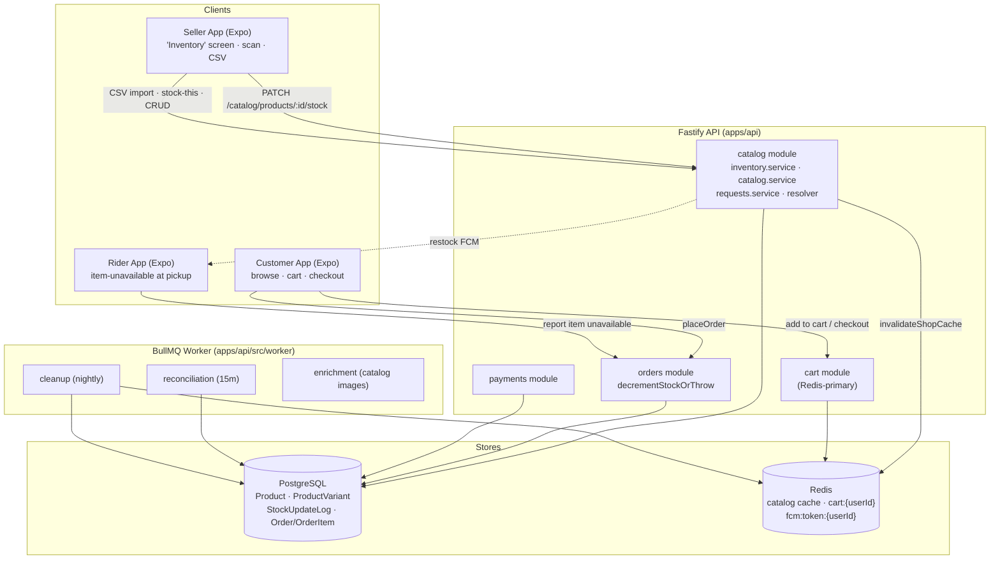
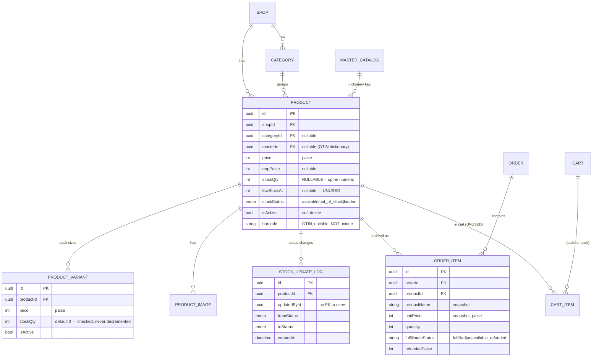
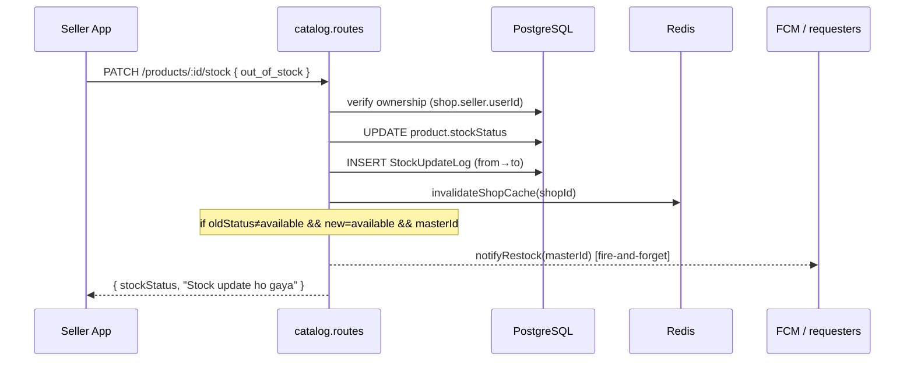
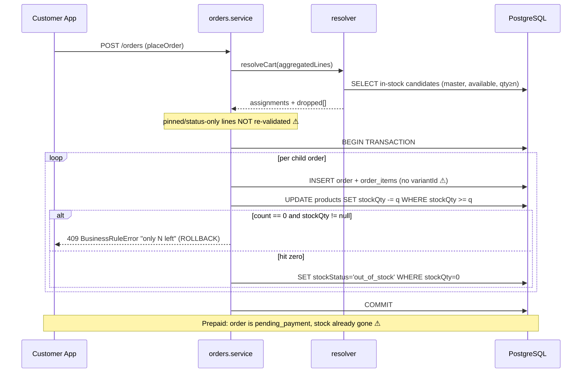
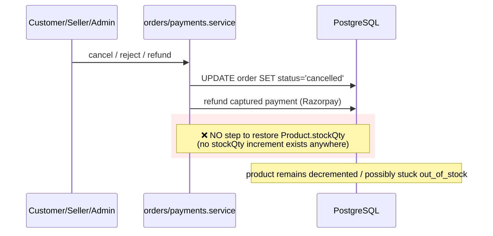

# Inventory Engine — Technical Analysis & Handover

> **Repo:** `chirawa` (pnpm monorepo) · **Branch analyzed:** `customer-app-validation`
> **Scope:** Everything that creates, mutates, reads, reserves, deducts, or restores product stock across the API, worker, and the three Expo apps.
> **Method:** Source-level audit. Every material claim is cited as `path:line`. Areas that could not be verified from the code are flagged **(UNCERTAIN)**.
> **Date:** 2026-06-29

---

## 1. Executive Summary

Chirawa is a hyperlocal quick-commerce platform (customer / seller / rider Expo apps + a Fastify + Prisma/PostgreSQL backend with a BullMQ worker). **There is no standalone "Inventory Engine."** Inventory is a thin capability embedded inside the **catalog** module, expressed as two parallel stock models on the `Product` row:

| Model | Field | Default? | Purpose | Status |
|-------|-------|----------|---------|--------|
| **Status-based** | `Product.stockStatus` enum `{available, out_of_stock, hidden}` | Always present (`available`) | The real, day-to-day availability switch sellers flip | **Production-ready** |
| **Numeric** | `Product.stockQty` (nullable INT) | `null` = untracked (opt-in) | Oversell protection — atomic decrement at checkout | **Partially built** |
| **Variant numeric** | `ProductVariant.stockQty` (INT, default 0) | Always 0+ | Per-pack-size availability | **Prototype / not wired to checkout** |

**The headline findings:**

1. ✅ **Status-based availability is solid.** Seller toggles `available ⇄ out_of_stock`, the change invalidates the Redis catalog cache, customers stop seeing it within seconds, and opted-in customers get an FCM "back in stock" push. This path is well-built and tested.

2. 🔴 **Numeric stock is decremented but never restored.** Stock is decremented atomically at order *creation* (`orders.service.ts:50,300`). There is **no `stockQty` increment anywhere in the codebase** — confirmed by a repo-wide grep. Cancellation, seller rejection, admin refund, payment failure, and abandoned prepaid checkouts all leave the decrement permanent. For sellers who opt into numeric tracking, every non-completed order silently erodes their on-hand count and can wrongly flip items to `out_of_stock`.

3. 🔴 **Prepaid orders decrement before payment.** A UPI/card order is created at `pending_payment` *with stock already decremented* (`orders.service.ts:261,300`). If the customer abandons or the payment fails, the reconciliation job only ever *promotes* successful payments (`payments.service.ts:264`) — it never cancels or releases the failed/abandoned ones, so the stock leaks **and** the order lingers in `pending_payment` forever.

4. 🔴 **Variant stock is validated but never deducted.** `decrementStockOrThrow` only touches `Product.stockQty`. Variant `stockQty` is checked at cart-add (`cart.service.ts:166`) but never decremented, and `OrderItem` has no `variantId` column — so the variant a customer bought isn't even recorded. Variants have zero oversell protection.

5. 🟠 **Three dead / half-wired artifacts:** `Product.lowStockAt` (no low-stock alerts; column unused since the migration that created it), `StockUpdateLog` (write-only — nothing ever reads it, and it only logs manual status toggles, not system deductions), and the `CartItem` table (never written — the cart lives entirely in Redis).

**Overall maturity:** Status-based inventory ≈ **90% / production-ready**. Numeric inventory ≈ **40%** — the happy path works, but the reservation/restoration lifecycle that makes stock counts *trustworthy* is missing. Variant inventory ≈ **20% / prototype**.

---

## 2. Architecture Overview

### 2.1 System context



### 2.2 The two stock models (why there are two)

The numeric model was **retrofitted** onto an originally status-only design. The migration trail proves it:

- `20260525012222_init` — `Product` ships with `stockStatus` only.
- `20260607041139_add_product_stock_qty` — adds `stock_qty INTEGER NOT NULL DEFAULT 0` **and** `low_stock_at INTEGER`.
- `20260607042748_product_stock_qty_opt_in` — immediately drops the `NOT NULL`/`DEFAULT` and resets every row to `NULL`. The migration comment itself says: *"the previous migration defaulted every existing product to 0, which would make them all 'tracked, 0 in stock' (unorderable)… nothing read stock_qty between the two migrations."*

So numeric stock is deliberately **opt-in** (`null` = untracked = treated as unlimited). The decrement logic is written to honor that (`orders.service.ts:43-48`). `low_stock_at` was added in the same migration as `stock_qty` and **was never wired to anything** (see §11/§13).

### 2.3 Data flow at a glance

- **Reads** (customer browse, product detail, search, shop page) go through `catalog.service.ts`, which filters on `stockStatus` (`{ not: 'hidden' }`, or `=== 'available'` for "in stock") and is **cached in Redis** per shop. Numeric `stockQty` is **not** exposed to customers — the product detail returns `stockStatus` for the product and a boolean `inStock: v.stockQty > 0` for each variant (`catalog.service.ts:716,727`).
- **Writes** (create/update/delete product, set stock, CSV import, "I stock this") go through `inventory.service.ts`, and every mutation calls `invalidateShopCache(shopId)` so the change is visible within seconds.
- **Deduction** happens exactly once, inside the checkout `$transaction` (`orders.service.ts:300`).
- **State management:** stock truth is in PostgreSQL; Redis holds derived/cached read models (catalog) and the live cart. There is no in-memory inventory state.

---

## 3. Folder Structure

```
apps/api/src/
├── modules/
│   ├── catalog/
│   │   ├── inventory.service.ts      ★ INVENTORY WRITES (CRUD, setStockQty, stock-this, CSV import)
│   │   ├── catalog.service.ts         read path (stockStatus filtering) + Redis cache + invalidation
│   │   ├── catalog.routes.ts          ★ stock-status toggle (writes StockUpdateLog), stock-qty, CRUD, import
│   │   ├── catalog.schema.ts          zod validation (stockQty bounds, barcode, MRP≥price)
│   │   ├── requests.service.ts        "request this item" + restock FCM fan-out (Phase 6)
│   │   ├── resolver.service.ts        ── (lives in orders/, see below)
│   │   ├── master.service.ts          barcode → MasterCatalog lookup (scan prefill)
│   │   ├── moderation.service.ts      catalog moderation (not stock)
│   │   ├── aggregation.service.ts     cross-shop "lowest in-stock price" feed
│   │   └── __tests__/                 inventory.service / inventory.import / inventory.stockthis
│   ├── orders/
│   │   ├── orders.service.ts          ★ decrementStockOrThrow + item-unavailable handling
│   │   ├── resolver.service.ts        ★ aggregated-line → concrete-shop resolver (re-validates stock)
│   │   └── __tests__/                 orders.stock / orders.unavailable / resolver.service
│   ├── cart/
│   │   └── cart.service.ts            availability checks at add/update (NO decrement); Redis-primary
│   └── payments/
│       └── payments.service.ts        pending_payment lifecycle, reconciliation, refunds
├── worker/
│   ├── scheduler.ts                   recurring schedules (none for inventory)
│   └── jobs/{reconciliation,cleanup,enrichment,...}.job.ts
└── prisma/
    ├── schema.prisma                  Product/ProductVariant/StockUpdateLog/Cart/Order models
    └── migrations/                    7 migrations touch inventory (see §5.7)

apps/seller-app/src/screens/stock/StockScreen.tsx   ★ seller "Inventory" UI (toggle, add/edit, scan, CSV)
apps/seller-app/src/services/api.service.ts          updateStock / setStockQty / CRUD / import clients
apps/seller-app/src/services/offline-queue.ts        offline "stock-this" replay queue
packages/types/src/enums/stock-status.enum.ts        StockStatus enum (shared)
```

★ = core inventory files.

---

## 4. Component Breakdown

### 4.1 `inventory.service.ts` — the write surface

**Purpose:** all catalog mutations a seller/admin can perform. **Factory:** `createInventoryService(prisma, redis, deps)`.

| Function | Inputs | Output | Internal logic | Notes / debt |
|---|---|---|---|---|
| `createProduct` | `CreateProductInput`, auth | `Product` | Ownership check; numeric stock **opt-in** (only sets `stockQty`+derives status if provided); GS1-validates barcode; invalidates cache | Clean |
| `upsertProductByBarcode` ("I stock this") | `StockThisInput`, auth | `{id, created}` | Idempotent upsert keyed by `(shopId, barcode)`; offline-queue depends on idempotency | Clean |
| `updateProduct` | `UpdateProductInput`, auth | `Product` | Field-by-field patch; enforces `MRP ≥ price`; sets `stockStatus` from `stockQty` when provided | Clean |
| `deleteProduct` | id, auth | `{id, isActive:false}` | **Soft delete** (keeps row so historical orders resolve) | Good |
| `setStockQty` | id, `stockQty`, auth | `{id, stockQty, stockStatus}` | Sets qty + derives status via `statusForQty` | **Does NOT fire restock-notify** even though status may flip to `available` (see §11) |
| `createVariant`/`updateVariant`/`deleteVariant` | variant input, auth | variant | Variant CRUD incl. `stockQty` (default 0) | Variant stock is **display-only** downstream |
| `importProductsCsv` | shopId, csv text, auth | `ImportReport` | Quote-aware CSV parser; rupees→paise; auto-creates categories; GS1 barcode gate; image re-hosting; idempotent by `(shopId,barcode)` then `(shopId,name)`; variant upsert by `(productId,variant_name)` | Solid, well-commented |

Key helper — **`statusForQty`** (`inventory.service.ts:67`): `qty > 0 ? 'available' : 'out_of_stock'`. This is the *only* place numeric qty derives status, and it never produces `hidden` (hidden is a manual-only state).

### 4.2 `orders.service.ts` — `decrementStockOrThrow` (the deduction engine)

**Location:** `orders.service.ts:50-74`. **Called from:** the checkout `$transaction` (`orders.service.ts:300`), once per child order.

```
for each line:
  count = updateMany WHERE id = productId AND stockQty >= quantity
                     SET stockQty = stockQty - quantity        // atomic, race-safe
  if count == 0:
     prod = findUnique(productId)
     if prod.stockQty != null:  throw BusinessRuleError("…only N left")   // tracked & insufficient
     else:                      continue   // untracked → unlimited → allowed
  else:
     updateMany WHERE id = productId AND stockQty = 0 SET stockStatus = 'out_of_stock'
```

- **Strength:** the `WHERE stockQty >= quantity` conditional update is the correct, lock-free oversell guard. Two concurrent checkouts cannot both win, and stock can never go negative for tracked products. Runs inside the order `$transaction`, so a throw rolls back the whole order.
- **Gaps:** (a) only `Product.stockQty` — never variants; (b) **no inverse** — nothing ever adds stock back; (c) the `out_of_stock` flip is one-directional and not reverted when the order is later cancelled.

### 4.3 `cart.service.ts` — availability gate (Redis-primary)

- **Cart storage:** Redis key `cart:{userId}`, 24h TTL (`cart.service.ts:61-65,91`). The Postgres `Cart` row is upserted as a **recovery stub only** (`saveCart`, lines 94-107) — it stores `shopId`/`expiresAt`, never the items. **`CartItem` is never written** (verified: zero `cartItem.create/update/...` calls).
- **Availability checks** (`addItem`): rejects `out_of_stock` (`:148`), treats `hidden` as 404 (`:151`), and for variants requires `stockQty > 0` (`:166`). `updateItem` re-checks on quantity change (`:265,274`).
- **No reservation:** adding to cart does **not** hold or decrement stock. Availability is a read-time check only → inherently TOCTOU (see §12).

### 4.4 `resolver.service.ts` — aggregated-line checkout resolver (the one place stock is re-validated)

For "aggregated" (fungible) cart lines — items whose `MasterCatalog` row is `approved`, shown in the cross-shop feed at the lowest in-stock price — the resolver re-routes each line to a concrete `(shop, product)` at checkout:

- Queries live candidates with `isActive: true, stockStatus: 'available', shop:{isActive,isOpen}` over the `@@index([masterId, stockStatus, isActive])` index (`resolver.service.ts:152-163`).
- A candidate is *viable* only if `stockQty == null || stockQty >= quantity` (`:85`) — i.e., untracked = unlimited, tracked must cover the qty.
- Greedy set-cover routes the cart through the fewest shops, never charging above the displayed lowest price. Lines nobody has in stock are **dropped** and surfaced to the customer as "just sold out" (`orders.service.ts:173-186,348`).

This is the **only** checkout path that re-validates availability against live inventory — and it applies **only to aggregated lines**. Pinned/legacy/status-only lines bypass it (§12).

### 4.5 `requests.service.ts` — demand capture + restock notify (Phase 6)

- `createRequest` records "I want this item" (optionally `notifyOnRestock`).
- `notifyRestock(masterId)` FCMs every opted-in requester once the master is back in stock, then stamps `notifiedAt` for at-most-once delivery (`requests.service.ts:111-134`).
- **Trigger coverage gap:** `notifyRestock` is invoked **only** from the manual stock-status toggle route (`catalog.routes.ts:180-182`) — not from `setStockQty`/`updateProduct`, even though those also flip status to `available`.

### 4.6 `StockScreen.tsx` — seller "Inventory" UI

- Lists products grouped by category with a binary **Switch** that toggles `available ⇄ out_of_stock` (`StockScreen.tsx:101-113,284`). The `hidden` state is **not** reachable from the UI.
- Header shows `X/Y available` — a count, not a low-stock indicator (`:247`).
- Add/Edit sheet accepts an optional `Stock qty` field. **But:** on Edit the field always opens blank (`:149`) and the seller-load path (`getShopProducts`) doesn't even return `stockQty` (`catalog.service.ts:234`). **Net effect: numeric stock is write-only to sellers — they can set it but can never see the current count.**
- Scan → `MasterCatalog` prefill → idempotent "stock-this" upsert, with an **offline replay queue** (`offline-queue.ts`, `:64-67,197`). CSV import is wired (`:115-137`).

---

## 5. Database Design

### 5.1 Inventory-relevant models



### 5.2 `Product` (the canonical stock row) — `schema.prisma:281-326`
- `stockQty Int?` — **nullable, opt-in.** `null` = untracked/unlimited; a number = tracked (decremented at checkout); `0` = out of stock.
- `stockStatus StockStatus @default(available)` — the always-present availability switch.
- `lowStockAt Int?` — **dead** (no reader/writer anywhere).
- `barcode VarChar(14)` — GTIN join key, **nullable and NOT unique** (the same GTIN legitimately recurs one-per-shop).
- `isActive Boolean` — soft-delete flag.

### 5.3 `ProductVariant` — `schema.prisma:331-346`
- `stockQty Int @default(0)` — **non-null.** Checked at cart-add but never decremented (§11).

### 5.4 `StockUpdateLog` — `schema.prisma:1023-1035`
- Append-only audit of **status** changes (`fromStatus → toStatus`). **Write-only:** the only writer is `catalog.routes.ts:165`; there are **zero** read queries against it anywhere in the repo. It captures manual toggles only — not the automatic `out_of_stock` flips from `decrementStockOrThrow`.

### 5.5 `CartItem` — `schema.prisma:488-502`
- Has a clean `@@unique([cartId, productId])` and FK to `Product`, **but is never written.** The cart is Redis-only. Dead table (vestigial design).

### 5.6 Indexes & constraints (inventory-relevant)
- `Product @@index([shopId, stockStatus, isActive])` — shop catalog listing.
- `Product @@index([masterId, stockStatus, isActive])` — the cross-shop aggregation + resolver query.
- `Product @@index([barcode])`, `@@index([categoryId])`, `@@index([name])`.
- `ProductVariant @@index([productId, sortOrder])`.
- `StockUpdateLog @@index([productId, createdAt desc])`.
- **No DB-level CHECK** forbidding negative `stockQty`. Non-negativity is enforced only at the app layer (the conditional decrement's `WHERE stockQty >= quantity` and zod `min(0)`). Acceptable for the product path; **unguarded for variants** (they're just never decremented).

### 5.7 Migrations touching inventory
| Migration | Effect |
|---|---|
| `20260525012222_init` | Base `Product` with `stockStatus` |
| `20260601221641_add_product_variants` | `ProductVariant` table |
| `20260607041139_add_product_stock_qty` | Adds `stock_qty NOT NULL DEFAULT 0` + `low_stock_at` |
| `20260607042748_product_stock_qty_opt_in` | Makes `stock_qty` nullable, resets all to NULL (opt-in) |
| `20260614120000_catalog_phase0` | `MasterCatalog`, `barcode`, `masterId`, `ProductRequest` |
| `20260614150000_catalog_phase5_orderitem_fulfillment` | `OrderItem.fulfillmentStatus` + `refundedPaise` |
| `20260614160000_catalog_phase6_request_notify` | `ProductRequest.notifyOnRestock` + `notifiedAt` |

---

## 6. API Documentation

All routes are under `/api/v1/catalog`. `writeGuard` = `authenticate + requireRole('seller','admin')`. Bodies validated by zod (`catalog.schema.ts`). Every write **invalidates the shop's Redis catalog cache**.

| Method · Route | Auth | Body / Params | Response | Side effects | Files |
|---|---|---|---|---|---|
| `PATCH /products/:id/stock` | seller/admin | `{ stockStatus }` | `{id, stockStatus, message}` | Writes `StockUpdateLog`; cache invalidation; **restock FCM** if master-linked & flipped→available | `catalog.routes.ts:132-186` |
| `PATCH /products/:id/stock-qty` | seller/admin | `{ stockQty:int≥0 }` | `{id, stockQty, stockStatus}` | Sets qty + derives status; cache invalidation. **No restock notify.** Client method exists (`api.service.ts:161`) but the seller UI saves via `updateProduct` instead | `catalog.routes.ts:209-213` |
| `POST /products` | seller/admin | `CreateProductInput` | `Product` (201) | Numeric stock opt-in; GS1 barcode check | `catalog.routes.ts:191-195` |
| `PATCH /products/:id` | seller/admin | `UpdateProductInput` | `Product` | Enforces MRP≥price; sets stock if provided | `catalog.routes.ts:198-202` |
| `DELETE /products/:id` | seller/admin | — | `{id, isActive:false}` | **Soft delete** | `catalog.routes.ts:205-207` |
| `POST /products/:id/variants` | seller/admin | `CreateVariantInput` | `Variant` (201) | — | `catalog.routes.ts:234-238` |
| `PATCH /variants/:id` · `DELETE /variants/:id` | seller/admin | variant patch | variant | Soft delete | `catalog.routes.ts:241-249` |
| `POST /products/import?shopId=` | seller/admin | multipart CSV (≤5MB) | `ImportReport` | Bulk upsert + image re-host | `catalog.routes.ts:252-263` |
| `POST /products/stock-this` | seller/admin | `StockThisInput` | `{id, created}` (201/200) | Idempotent `(shopId,barcode)` upsert | `catalog.routes.ts:293-297` |
| `GET /master/:barcode` | seller/admin | barcode | master prefill | Live OFF fallback bootstraps a master | `catalog.routes.ts:269-272` |
| `POST /products/:id/report-image` | any auth | `{reason?}` | `{reported:true}` | Re-gates master to `needs_review` | `catalog.routes.ts:302-319` |

**Stock deduction is not an endpoint** — it is a side effect of `POST /orders` (checkout), executed inside the order transaction (`orders.service.ts:300`).

---

## 7. Inventory Workflow

The *actual* lifecycle (adapted from the generic template to what the code does):

```
Product created (status-only by default; numeric stock OPT-IN)
  └─ Seller toggles available ⇄ out_of_stock  → StockUpdateLog + cache bust + restock FCM
  └─ (optional) Seller sets stockQty           → status derived, but seller can't see the number

Customer adds to cart  → availability CHECK only (no hold/reserve) [Redis]
  ▼
Checkout (placeOrder)
  ├─ Aggregated lines → resolver re-validates live stock, routes to fewest shops, drops sold-out
  ├─ Pinned/status-only lines → passed through WITHOUT re-checking stockStatus  ⚠ (TOCTOU)
  └─ decrementStockOrThrow (inside $transaction)
        ├─ tracked product: atomic conditional decrement; flip→out_of_stock at 0; throw if insufficient
        ├─ untracked product: skipped (unlimited)
        └─ variant: NOT decremented  ⚠
  ▼
Order created
  ├─ COD → status 'confirmed'
  └─ Prepaid → status 'pending_payment'  (stock ALREADY decremented, BEFORE payment) ⚠
  ▼
… happy path → preparing → ready → picked_up → delivered  (stock stays decremented ✓ correct)

… UNHAPPY paths — STOCK IS NEVER RESTORED: 🔴
  ├─ Customer cancel        (cancelOrder)          → refund, no restock
  ├─ Seller reject          (sellerRejectOrder)    → refund, no restock
  ├─ Admin refund           (initiateRefund)       → refund, no restock
  ├─ Payment failed         (webhook payment.failed) → marks payment failed only; order stuck; no restock
  ├─ Prepaid abandoned      (reconciliation)        → never cancelled/released; stock leaked
  └─ Rider item-unavailable (reportItemUnavailable) → line refunded + product set out_of_stock (status),
                                                       but the earlier stockQty decrement is NOT reversed
```

---

## 8. Sequence Diagrams

### 8.1 Seller toggles stock status (the working path)



### 8.2 Checkout deduction (oversell protection)



### 8.3 The missing restock-on-cancel (gap visualization)



---

## 9. Entity Relationship Diagram

See **§5.1** for the full inventory ER diagram (Mermaid). Summary of cardinalities:

- `Shop 1—N Product`, `Shop 1—N Category`, `Category 1—N Product` (nullable).
- `Product 1—N ProductVariant`, `1—N ProductImage`, `1—N StockUpdateLog`, `1—N OrderItem`.
- `MasterCatalog 1—N Product` (the GTIN dictionary; `Product.masterId` nullable).
- `Order 1—N OrderItem`; `OrderItem N—1 Product` (no `variantId` link).
- `Cart 1—N CartItem` exists in schema but is **unused at runtime**.

---

## 10. Current Working Status

| Capability | Status | Evidence |
|---|---|---|
| Status availability (available/out_of_stock/hidden) | ✅ **Fully implemented** | `catalog.routes.ts:132`, `cart.service.ts:148`, `catalog.service.ts` filters, `StockScreen.tsx:284` |
| Catalog cache invalidation on writes | ✅ Working | `invalidate()` in every `inventory.service` mutation |
| Restock "notify me" on manual toggle | ✅ Working | `requests.service.ts:111`, `catalog.routes.ts:180` |
| Numeric oversell protection (product) | 🟡 **Partial** — happy path only | `orders.service.ts:50` works; but no restore, no visibility |
| Numeric stock restoration (cancel/refund/fail) | 🔴 **Missing** | no `stockQty` increment anywhere (repo-wide grep) |
| Variant stock deduction | 🔴 **Missing / prototype** | checked at `cart.service.ts:166`, never decremented |
| `OrderItem` variant identity | 🔴 Missing | no `variantId` column (`schema.prisma:612`) |
| Low-stock alerts | 🔴 **Missing** | `lowStockAt` unused outside schema |
| Stock audit / history | 🟡 Partial (write-only, status-only) | `StockUpdateLog` never read |
| Soft deletes | ✅ Implemented | `isActive` on Product/Variant/Category |
| Bulk CSV import | ✅ Implemented & tested | `inventory.service.ts:331`, `inventory.import.test.ts` |
| Barcode "stock-this" + offline queue | ✅ Implemented & tested | `inventory.service.ts:149`, `inventory.stockthis.test.ts` |
| Multi-warehouse / batch-lot / serial / PO / transfers / damaged / forecasting | 🔴 Absent | not in schema or code |

**Verdict:** the inventory system is **two features wearing one name.** Status-based availability is *production-ready*. Numeric quantity tracking is a *partially-built feature* that is safe only on the happy path and actively misleading on the unhappy paths.

---

## 11. Missing Features (for a production-ready inventory system)

**Implemented:** status availability · soft delete · bulk CSV import · barcode upsert + offline replay · atomic product-level oversell guard · cross-shop in-stock resolution · restock notify (toggle path).

**Missing / incomplete:**

1. 🔴 **Stock reservation with TTL hold + auto-release.** Today checkout is a hard commit; there is no "hold for N minutes then release." This is the root cause of #2/#3.
2. 🔴 **Stock restoration on cancel / seller-reject / admin-refund / payment-failure / abandonment.** The single biggest correctness gap.
3. 🔴 **Variant-level deduction** and `OrderItem.variantId` (record + decrement the variant actually sold).
4. 🔴 **Low-stock alerts** (`lowStockAt` exists; wire it to a threshold check + seller notification/badge).
5. 🟠 **True inventory ledger / movement history** (in/out/reserve/release/adjust with reason). `StockUpdateLog` is status-only and write-only.
6. 🟠 **Seller numeric-stock visibility + adjustments UI** (the seller cannot currently see `stockQty`).
7. 🟠 **Consistent restock-notify trigger** (also fire from `setStockQty`/`updateProduct`, not only the toggle route).
8. 🟠 **Checkout re-validation of `stockStatus` for pinned/status-only lines** (close the TOCTOU in §12).
9. 🟢 **DB-level non-negativity constraint** for variant stock (defense in depth).
10. ⚪ **Multi-warehouse, batch/lot, serial numbers, purchase orders, transfers, damaged/shrinkage, demand forecasting** — not applicable to the current single-location quick-commerce model, but absent if the business expands.

---

## 12. Bugs & Risks

### 🔴 BUG-1 — Decremented stock is never restored (data-integrity, highest impact)
`decrementStockOrThrow` (`orders.service.ts:50`) decrements at order creation. **No code path ever increments `stockQty`** (verified by repo-wide grep for `stockQty.*increment`). Every cancel (`orders.service.ts:612`), seller reject (`:564`), admin refund (`payments.service.ts:204`), and rider item-unavailable (`:759-822`) leaves the decrement permanent — and may leave the product stuck at `stockStatus='out_of_stock'`.
**Blast radius:** bounded to products with `stockQty != null` (opt-in). Untracked products (the default) are unaffected. For sellers who *do* track numerically, on-hand counts drift downward with every non-completed order until they manually reset.

### 🔴 BUG-2 — Prepaid orders decrement before payment; failures/abandonments leak stock
Order is created at `pending_payment` *with stock decremented* (`orders.service.ts:261,300`). The `payment.failed` webhook only marks the `Payment` row failed (`payments.service.ts:182-190`) — it does **not** cancel the order or restore stock. `reconcilePendingPayments` (`payments.service.ts:264`) only *promotes* orders that actually got captured; it never cancels truly-failed/abandoned ones. Result: abandoned prepaid checkouts **permanently** leak tracked stock and leave zombie `pending_payment` orders.

### 🔴 BUG-3 — Variants have no oversell protection and lose their identity
`decrementStockOrThrow` never touches `ProductVariant.stockQty`. A variant's stock is validated at cart-add (`cart.service.ts:166`) but is **infinitely oversellable** thereafter. Worse, `OrderItem` has no `variantId` (`schema.prisma:612`), so the system can't even tell which variant was purchased (only the price + a `"Name (variant)"` string snapshot survive).

### 🟠 BUG-4 — TOCTOU for pinned / status-only lines at checkout
In `placeOrder`, only **aggregated** lines are re-validated by the resolver. Pinned/legacy/status-only lines are pushed straight into the order (`orders.service.ts:180-182`) and `decrementStockOrThrow` only guards *numeric* products. So a status-only product that went `out_of_stock` (or was soft-deleted) **after** being added to a stale cart will still be sold. The shop's `isActive` is re-checked (`:205`) but the product's `stockStatus`/`isActive` is not.

### 🟠 BUG-5 — Restock-notify misses the numeric path
Going from `stockQty 0 → >0` via `setStockQty`/`updateProduct` flips status to `available` (`statusForQty`) but does **not** call `notifyRestock` — only the manual `/stock` toggle does (`catalog.routes.ts:180`). Customers who asked to be notified won't be when a seller restocks numerically.

### 🟠 RISK-6 — `StockUpdateLog` is write-only & incomplete
Nothing reads it (no admin/seller history view), and it records only manual status toggles — never the system's own `out_of_stock` flips. As an audit trail it is currently non-functional.

### 🟢 OBSERVATION-7 — `lowStockAt` and `CartItem` are dead
`lowStockAt` (column since `add_product_stock_qty`) and the entire `CartItem` table are unreferenced at runtime. Harmless but misleading to new developers.

> **No customer-facing stock-count leak:** the product detail exposes only `stockStatus` and a boolean `inStock` per variant (`catalog.service.ts:716,727`) — raw `stockQty` is not returned to customers. Good.

---

## 13. Technical Debt

| Item | Type | Location | Impact |
|---|---|---|---|
| Two divergent stock models (status vs numeric) with no single "is this orderable?" function | Missing abstraction | `cart`, `orders`, `catalog`, `resolver` each re-implement availability | Inconsistent rules; the TOCTOU + variant gaps stem from this |
| `lowStockAt` column unused since creation | Dead code | `schema.prisma:293` | Misleads; implies a feature that doesn't exist |
| `CartItem` table never written | Dead code | `schema.prisma:488` | Misleads; cart is Redis-only |
| `StockUpdateLog` write-only | Dead-end data | `catalog.routes.ts:165` | Audit trail that nobody can see |
| `setStockQty`/`/stock-qty` endpoint reachable but unused by the UI (UI saves via `updateProduct`) | Redundant path | `catalog.routes.ts:209`, `StockScreen.tsx:185` | Two ways to set numeric stock; one untested in-app |
| Seller cannot view `stockQty` (`getShopProducts` omits it; edit form blanks it) | Half-built feature | `catalog.service.ts:234`, `StockScreen.tsx:149` | Numeric stock is effectively unusable for sellers |
| Availability re-implemented per call site (`stockStatus !== 'hidden'`, `=== 'available'`, `stockQty > 0`) | Duplicate logic | catalog.service.ts (many), cart, resolver | Drift risk |
| Hinglish error strings hardcoded in services | i18n debt | `orders.service.ts:64`, `cart.service.ts:149` | Hard to localize/test |

---

## 14. Estimated Remaining Work

Engineering estimates assume one mid/senior backend engineer familiar with this stack. "Effort" includes implementation + unit tests + a migration where needed.

| Module | Status | Estimated Effort |
|---|---|---|
| Restock on cancel/reject/refund/payment-fail (inverse of `decrementStockOrThrow`, idempotent, in the same transactions) | 🔴 Missing | **2–3 days** |
| Stock reservation w/ TTL hold + release job (replace hard-commit; release abandoned prepaid) | 🔴 Missing | **4–6 days** |
| Variant deduction + `OrderItem.variantId` (migration + decrement + cart/checkout wiring) | 🔴 Missing | **3–4 days** |
| Checkout re-validation for pinned/status-only lines (close TOCTOU) | 🟠 Partial | **1 day** |
| Low-stock alerts (wire `lowStockAt` → threshold check + seller badge/notification) | 🔴 Missing | **2 days** |
| Inventory movement ledger (replace status-only `StockUpdateLog`; cover system deductions) + read UI | 🟠 Partial | **3–4 days** |
| Seller numeric-stock visibility + adjustments UI (return `stockQty`, show in edit, +/- controls) | 🟠 Partial | **2 days** |
| Consistent restock-notify trigger (fire from numeric path too) | 🟠 Partial | **0.5 day** |
| Remove/relabel dead artifacts (`CartItem`, `lowStockAt` if not wired, redundant endpoint) | 🟢 Cleanup | **0.5 day** |
| Status-based availability (toggle, filtering, cache, restock-on-toggle) | ✅ Complete | **0 days** |
| Bulk CSV import / barcode stock-this / offline queue | ✅ Complete | **0 days** |

**Suggested implementation order** (each builds on the last and de-risks the next):

1. **Restock-on-cancel** (BUG-1) — smallest change, biggest correctness win; makes numeric stock *safe to trust* on the unhappy paths.
2. **Reservation + release job** (BUG-2) — fixes prepaid leakage and zombie `pending_payment` orders.
3. **Checkout re-validation for pinned lines** (BUG-4) — cheap, closes the oversell window for status-only items.
4. **Variant deduction + `variantId`** (BUG-3) — needs a migration; do it before pushing variants as a real feature.
5. **Seller visibility + low-stock alerts + ledger** — operational maturity once the core counts are trustworthy.

**Overall estimate to make numeric inventory production-grade:** ≈ **15–20 engineering days** (≈ 3–4 weeks with review/QA). Status-based inventory needs **0 days** — it already is.

---

## 15. Recommendations

1. **Make stock counts trustworthy before exposing them.** Until BUG-1/BUG-2 are fixed, numeric `stockQty` should be treated as advisory. Consider keeping sellers on the (reliable) status toggle and gating numeric tracking behind the reservation/restoration work.
2. **Introduce one availability authority.** A single `isOrderable(product|variant, qty)` + paired `reserve()/release()/commit()` helpers, reused by cart, resolver, and checkout. This collapses the duplicated `stockStatus` checks and structurally prevents the variant/TOCTOU gaps from recurring.
3. **Model stock movements, not just status.** Replace the write-only `StockUpdateLog` with a movement ledger (`+/- qty, reason ∈ {sale, cancel, restock, adjust, reserve, release}`) covering *system* deductions too. This gives auditability and a natural place to compute on-hand = Σ movements.
4. **Decrement at the right moment.** Either (a) reserve at checkout + commit at payment-capture/COD-confirm + release on failure, or (b) decrement only once an order is actually `confirmed`/`paid`. Current "decrement at `pending_payment`, never release" is the worst of both.
5. **Decide variants' fate explicitly.** Either finish them (deduct + `variantId` + seller UI) or hide the variant UI until then — shipping "validated but infinitely oversellable" variants is a latent oversell incident.
6. **Delete or wire the dead artifacts** (`CartItem`, `lowStockAt`, redundant `/stock-qty` path) so the schema stops implying capabilities that don't exist.

---

## 16. Final Conclusion

Chirawa's inventory is best understood as **a robust status-availability system with a half-finished numeric-quantity feature bolted on.** The status path — seller toggle → cache invalidation → customer filtering → restock notification — is well-engineered, tested, and production-ready, and it is what the seller UI actually drives day to day.

The numeric path tells a different story. The deduction primitive itself is excellent (a lock-free, race-safe conditional decrement). But it lives inside a lifecycle that **never gives stock back** and that **decrements prepaid orders before they're paid for**, so on every unhappy path — cancel, reject, refund, payment failure, abandonment, even a rider finding an item missing — tracked stock silently drains and items get stuck out-of-stock. Variants are checked but never deducted and aren't even recorded on the order. The audit log is write-only, low-stock alerts don't exist despite the column, and sellers can't see the numeric count they're supposedly maintaining.

None of this is catastrophic *today* because numeric tracking is opt-in and most products run status-only — which is precisely why the gaps haven't bitten hard yet. But the moment a seller starts trusting `stockQty`, the missing reservation/restoration lifecycle becomes a daily correctness problem. The fix is well-scoped (≈ 3–4 weeks, ordered in §14) and mostly additive. Prioritize **restock-on-cancel** and **reservation-with-release** first: they convert numeric inventory from "misleading" to "trustworthy," after which the remaining items (variants, visibility, alerts, ledger) are incremental polish.

---

### Appendix — Evidence index (primary citations)
- Deduction: `apps/api/src/modules/orders/orders.service.ts:50-74, 300`
- Placement / prepaid status: `orders.service.ts:150-186, 261-312`
- Cancel / reject / refund: `orders.service.ts:564-588, 612-653`; `payments.service.ts:182-262`
- Reconciliation (no release): `payments.service.ts:264-285`; `worker/jobs/reconciliation.job.ts`
- Item-unavailable (rider): `orders.service.ts:740-822`
- Inventory writes: `apps/api/src/modules/catalog/inventory.service.ts`
- Stock routes + `StockUpdateLog` write: `apps/api/src/modules/catalog/catalog.routes.ts:132-213`
- Read/filtering + customer exposure: `apps/api/src/modules/catalog/catalog.service.ts:196-264, 686-738`
- Resolver (re-validation): `apps/api/src/modules/orders/resolver.service.ts:69-181`
- Cart (Redis-primary, checks only): `apps/api/src/modules/cart/cart.service.ts:79-323`
- Restock notify: `apps/api/src/modules/catalog/requests.service.ts:111-134`
- Schema: `apps/api/prisma/schema.prisma:281-346, 1023-1035`
- Migrations: `apps/api/prisma/migrations/2026060704113{9,…}_*`
- Seller UI: `apps/seller-app/src/screens/stock/StockScreen.tsx`
